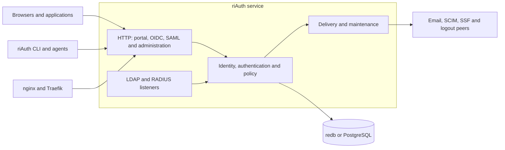

# Application architecture

The [documentation index](README.md) links setup and protocol contracts. [Release limitations](limitations.md) and [testing](testing.md) describe deployment boundaries and validation.

## System map

Network listeners and integrations are enabled separately by configuration.

## Entry points and request handling

One Rust crate builds the `riauth` binary and library. [CLI dispatch](../src/cli.rs) handles local initialization, restore, import and configuration, then uses [remote transport](../src/cli/transport.rs) for authenticated server operations. The remote client pins saved sessions and agent credentials to the configured issuer, rejects redirects and uses a configurable per-request timeout (`--request-timeout` / `RIAUTH_REQUEST_TIMEOUT`, default 30 seconds). It does not refresh human sessions automatically.

[The HTTP router](../src/api.rs) exposes protocol and management routes under the issuer path; [interaction routes](../src/api/interaction.rs) serve the sign-in, consent and sign-out pages. Blocking application operations share eight worker permits and wait up to two seconds for one before returning `503 temporarily_unavailable`. Password checks first take one of four credential permits and hand both permits to the blocking task, so hashing never occupies more than half the workers, even for clients that hang up; forward-auth checks use their own sixteen permits. [Rate-limit counters](../src/api/rates.rs) are fixed 60-second windows kept in start order; a full table evicts its oldest window. [Probes](../src/api/probes.rs) use a separate bounded path: `/livez` is liveness, while `/readyz` and `/healthz` check storage readiness. [Observability](../src/api/observability.rs) adds request IDs, bounded metric labels and response headers.

[The server](../src/api/server.rs) supports HTTP behind a trusted proxy or native rustls HTTPS. LDAP, RADIUS and reverse-proxy listeners are separate configured network surfaces. [Portal assets](../src/portal/) are embedded HTML/CSS/JavaScript; no frontend build is needed to serve them.

## Browser sign-in and sessions

Browsers sign in directly, with a passkey or with a password plus an optional TOTP or recovery code, on the portal or on the interaction page an application's request leads to. Terminal approval remains an alternative on every page. The [portal](PORTAL.md) and [OIDC guide](oidc-profiles.md) describe the user-facing and protocol behavior.

- **Two phases.** [Sign-in primitives](../src/signin.rs) first verify the credential with the same password, TOTP, recovery-code, lockout and LDAP code the CLI uses, and commit a *staged login* (two minutes). A second transaction attaches it: it merges into this browser's session for the same user, replaces another user's browser session, or creates a new one. Pages give a browser without an SSO cookie a placeholder value that maps to no session, so concurrent first sign-ins from two tabs converge through the same 60-second tombstone that concurrent re-authentications use.
- **Browser-owned sessions.** A browser sign-in creates a session with no bearer token. The browser holds only the HttpOnly SSO cookie (`__Host-riauth_sso` on https). A terminal-approved browser still shares the approving CLI session, but must sign in itself before it may change passkeys. `riauth session list` reports each session's `kind`, `browser` or `terminal`.
- **Request binding.** A sign-in inside an OIDC or SAML request writes a proof bound to that request and session, so `prompt=login`, `max_age` and step-up cannot be satisfied by another tab. A sign-in that would not meet the client's MFA or ACR requirement is refused before any session is created.
- **Interaction pages.** An HTML request to `/oauth/authorize`, `/saml/{id}/sso`, `/saml/{id}/init` or `/oauth/logout` gets a 303 to its resume path, which serves [the page](../src/portal/signin.html). [Its script](../src/portal/signin.js) reads a read-only `state` endpoint and posts JSON through the browser write guard. JSON callers keep the terminal contract.
- **Forward auth.** [The outpost](../src/outpost.rs) answers nginx `auth_request` at `/outpost/{id}/auth` and Traefik forwardAuth at `/outpost/{id}/traefik`, both read-only. Login starts at `/outpost/{id}/start` and redeems its code inside riAuth.

## Identity, authorization and protocols

[Core](../src/core.rs) owns configuration and storage access. [The model](../src/model.rs) defines users, groups, clients, sessions and grants. Shared [claims/policy](../src/claims.rs), [assurance](../src/assurance.rs), [provider](../src/provider.rs) and [authorization](../src/authorization.rs) code connects OIDC, portal, SAML, LDAP and proxy behavior. Temporary [PAM grants](../src/pam.rs) add effective groups without changing durable group membership; SCIM, LDAP and user CSV consistently project durable membership. Effective authentication groups use a per-user grant index. [Device-trust verification](../src/device_trust.rs) binds proofs to the originating session, user epoch and fixed device id, and caps expiry by the proof and session.

[OIDC](../src/oidc.rs), [JOSE](../src/jose.rs), [DPoP](../src/dpop.rs), [token exchange](../src/exchange.rs), [registration](../src/registration.rs) and [browser handoff](../src/browser.rs) implement the documented OAuth profiles. [Source federation](../src/source.rs) and [SAML sources](../src/source/saml.rs) bind upstream identities to explicit local accounts. [Passkeys](../src/passkey.rs), [TOTP](../src/authenticator.rs), [certificate login](../src/mtls.rs), [password history](../src/password_history.rs) and [email lifecycle](../src/lifecycle.rs) cover local authentication and recovery.

Agents use separate scoped credentials through [agent authorization](../src/agent.rs). [Desired state](../src/state.rs), [mutation context](../src/context.rs), [resource inventory](../src/resource.rs) and [schemas](../src/schema.rs) support reviewable plans, conditional writes and retry receipts. These permissions do not grant end-user authentication or administrator delegation.

## Storage and background work

[The store](../src/store.rs) provides either process-owned redb or [PostgreSQL](../src/postgres_store.rs). Authentication/token operations can prepare expensive work outside a writer, then [revalidate](../src/store/prepared.rs) before commit. Management writes and quota updates still serialize. PAM grant lookup uses a per-user index, and offboarding claims use a due-work index. [Schema version 3](../src/upgrade.rs) and [derived indexes](../src/store/maintenance.rs) support bounded maintenance pages and delivery queues. Derived-index revisions are backfilled atomically on upgrade and restored archives rebuild indexes. User-disable writes centrally revoke owned agents and Windows devices; security transitions enqueue SSF notifications in the same transaction.

The HTTP server starts these workers:

| Worker | Nominal interval | Contract |
| --- | --- | --- |
| Outbound SCIM | 250 ms | Deliver reviewed provisioning jobs with durable state |
| Logout and SSF | 2 seconds | Process their durable delivery queues sequentially |
| Account email | 5 seconds | Deliver mail with durable retry/lease state |
| Maintenance | 60 seconds | Cleanup, up to eight offboarding jobs, then optional alert dispatch |
| Native TLS reload | 60 seconds after startup | Replace valid TLS material; retain the active configuration on failure |

Intervals are scheduling settings, not completion deadlines; storage, network delays and queue size affect progress. Offboarding currently revokes local access only. Logout, email, SCIM, SSF and offboarding use five indexed queues; offboarding jobs retain leases and revalidate their creator’s parent authority before execution. [Operations](operations.md) describes retries, metrics and recovery limits.

[Backups](../src/operations.rs) read one consistent snapshot in plaintext pages and produce authenticated v2 ciphertext chunks plus a final manifest. The complete ciphertext response is buffered within a 64 MiB archive limit; the new writer limits serialized plaintext pages to 8 MiB (restore accepts older larger chunks within the archive cap). Restore rejects oversized input before reading it and restores one decrypted chunk at a time into a new redb directory. CSV exports write bounded pages to a private temporary file and publish the complete result atomically. External configuration files, secret files and remote services still need separate recovery arrangements.

## Verification

`tests/identity.rs` includes protocol/security modules in `tests/identity/`; dedicated tests cover CLI, storage, operations, portal and each advanced feature. Browser sign-in has its own suites: `tests/signin_core.rs`, `tests/browser_signin.rs`, `tests/worker_capacity.rs`, `tests/rate_limits.rs` and `tests/outpost_traefik.rs`. The `test-support` feature enables controlled-clock fixtures and `fuzzing` exposes retained parser-corpus checks. Some integrations need external programs or services, including a real Traefik (`RIAUTH_TEST_TRAEFIK`). The [browser project](../tools/browser/package.json) exercises Chromium, Firefox and WebKit separately. See [testing](testing.md) for checks against the exact source and deployment.
