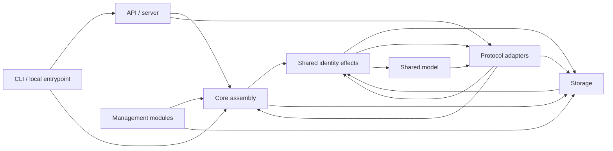
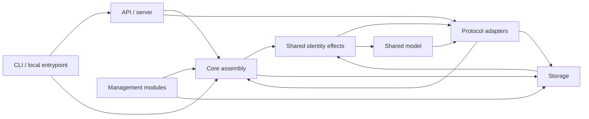
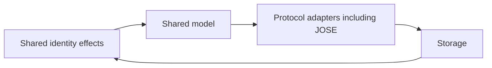
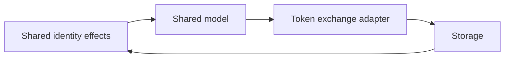

# A03 shared module boundaries

This slice starts from dependency-updated revision `96e23e2`. It follows the
reviewed A01 dependency inventory and Q01 contracts RI-SES-004/005,
RI-CON-004 and RI-STORE-001. The A02 distribution boundary is preserved; this
change introduces no product inclusion, capability gating or separate build.

## Selected cut

Two candidate edges were examined. `model::ProviderSettings` embeds types from
portal, SAML, RADIUS, LDAP and proxy adapters. Storage also called account
revocation in the large `Core` module and notification enqueue in the SSF
adapter. The latter is selected because it puts the shared account transition
and its durable effects behind one implementation before subsequent assembly
work, while retaining the existing transaction machinery.

The production dependency changes are:

| Before | After |
| --- | --- |
| `store -> core::user_security_transition` | `store -> identity::record_transition`; the transition implementation is removed from `core` |
| `store -> ssf::enqueue` | `store -> identity::record_transition -> identity::signals::enqueue`; enqueue and its persisted record definitions are removed from the SSF adapter |
| `core` implements live user/epoch and session-owner checks | `core -> identity::validate_user/validate_session`, with one implementation of those checks |
| Core and RP logout enqueue through SSF | Both enqueue through the shared durable signal module |

[identity.rs](../src/identity.rs) owns user-state epoch normalization, account
liveness, session binding, dependent credential revocation and credential-change
classification. [identity/signals.rs](../src/identity/signals.rs) owns the existing
stream/delivery storage records and transactional enqueue/deduplication. Neither
module imports `core` or `ssf`. This is implementation extraction, not a forwarding
facade that still executes the previous Core/SSF implementations.

[ssf.rs](../src/ssf.rs) retains inbound signature/issuer/subject/event validation,
management authorization, signing, delivery-time disclosure checks, HTTP delivery,
retries and protocol replay cleanup. Its public `Stream`, `Delivery`, event
constants and crate-internal enqueue path are compatibility re-exports of the
single shared definitions. Existing public Core, Store, Tx and test APIs remain.
The persisted buckets, fields, defaults, event URIs and schema versions are
unchanged. Enqueue persists intent; it does not perform network work or promise
exactly-once remote delivery.

## Preserved ordering and semantics

1. `Tx::put` reads the prior user/passkey record, normalizes a changed account
   state's epoch, updates indexes and redacted changes, and writes the record.
   `Tx::delete` updates indexes and changes and deletes the record.
2. Both invoke the shared transition in that same transaction. Disabling/deleting
   a user, or touching a previously disabled user, revokes owned agent tokens,
   Windows devices and sign-in tickets, then queues RP logout, then the account
   disabled signal for an enabled-to-disabled transition. Re-enable repairs
   legacy dependents and never emits another account-disabled event.
3. Password replacement requires both a changed hash and epoch; transparent
   rehash is not replacement. TOTP changes, recovery-code rotation and passkey
   insertion/removal retain their existing classifications. Factor use is not
   rotation. Per-transaction signal deduplication and ended RP-session records
   retain exactly-once local intent behavior.
4. Writer abort and preview discard every effect and index. Prepared writes stage
   the same effects, recheck their reads/ranges/deadlines and retry from a fresh
   transaction; they do not replay hooks after commit. The redb and PostgreSQL
   transaction implementations are unchanged. Offline snapshot `import_record`
   still deliberately bypasses the hook; restore policy is separate work.
5. Core still checks RADIUS EAP, mTLS, directory and source bindings in that order,
   then shared account liveness, then session ownership/revocation where required.
   Bearer expiry remains in `Core::session`; explicit offline grants do not gain
   a new CLI-expiry restriction. Administrator, scoped-agent, client/group/claims,
   assurance and device-policy checks stay at their existing call sites.

## Remaining coupling after the first cut

This is an intra-crate boundary, not complete A03 acceptance. Storage still knows
which records receive hooks and depends on shared identity semantics, configuration,
crypto, audit projections and backend modules. Identity effects still call the
existing agent, Windows and RP logout persistence helpers; those modules also
contain Core methods, so transitive cycles remain. At this first-cut handoff,
signal persistence still used the existing SSF-shaped records and JOSE key type.
Core still assembles adapter
validation and protocol cleanup. None of these facts establishes an independently
compilable identity/storage crate or distribution parity.

The next bounded A03 slice identified at this handoff was the provider-settings
data extraction. Its implementation and verification are recorded below. A later
slice can introduce explicit persistence ports for dependent credentials and
notifications to remove the remaining transitive identity-to-adapter cycles.

Q02 can continue using the baseline public APIs, `tests/common` helpers and SSF
record paths. No unreviewed Q02 code is incorporated. Integration with its
contracts and later architecture/engine/assembly changes still requires
orchestrator review.

## Verification scope

[identity_boundary.rs](../tests/identity_boundary.rs) adds plaintext/encrypted
storage regressions for real user, owned agent, Windows device/ticket and RP
session state. It checks effects and queue indexes inside the transaction;
preview, writer/prepared abort, enqueue failure and a forced optimistic retry;
disable/delete, re-enable, omitted epoch bumps, passkey intent deduplication and
unrelated-subject isolation. The existing identity, offboarding, storage and SSF
suites remain the primary behavior regressions. Actual commands and results are
recorded in `target/riwork/A03-results.md` for the orchestrator; this note does not
claim release, cross-build or real-peer acceptance.

## Continuation: shared provider settings data

The reviewed A02 target contract is now accepted. This continuation changes no
product inclusion or support claim. [client_settings.rs](../src/model/client_settings.rs)
is the canonical data-only home for the five setting families: portal `Settings`;
SAML `NameIdFormat`, `Attribute`, `Settings`; RADIUS `ReplyValue`, `Attribute`,
`Settings`; LDAP `Settings`; and proxy `Domain`, `Settings`. Their derives, field
order, Serde attributes and default functions moved intact. `ProviderSettings`
now refers directly to these shared types instead of importing five adapter
`Settings` types. The adapter modules re-export their old public paths, while
their validation and protocol methods stay in place; `Core`, provider validation
and authorization call sites are unchanged.

This demonstrably removes the five direct `model -> adapter::Settings` references.
Baseline checksums for the public provider schema, each individual/nested schema
and serialized stored-client JSON are fixed in
[provider_settings_boundary.rs](../tests/provider_settings_boundary.rs); its
fixture includes every setting family and exercises their default/unknown-field
rules and redb round-trip. The exact regression results are in the continuation
handoff under `target/riwork/`.

The model still refers to authenticator, JOSE, exchange, claims, encryption and
source types, and `config` still aggregates protocol/connector sections. Adapters
still depend on `Core` and the model; Core still assembles their validation and
runtime behavior. At that handoff, the shared identity effects invoked agent,
Windows and logout helpers from modules that also contained Core methods.
No independent crate, build gating, client split, management unification or full
A03 acceptance follows from this data extraction.

## Continuation: parent-owned agent credential persistence

[agent_credentials.rs](../src/identity/agent_credentials.rs) now owns the stored
`Agent` and `Permission` definitions and the transactional `revoke_owned` helper.
The former public `agent::Agent` and `agent::Permission` paths re-export those
same types. Agent management, parent authority checks, permission evaluation and
audit attribution remain in [agent.rs](../src/agent.rs). Storage's public agent
projection uses the shared record directly.

This removes the direct `identity -> agent::revoke_owned` call and the direct
`store -> agent::Agent` reference. Identity still performs the existing sequence:
drop owned agent token indexes, disable owned agents, revoke Windows devices and
one-time tickets, queue RP logout, then enqueue account-disabled intent when
applicable. All writes stay in the caller's transaction; no persisted fields,
Serde defaults, permission schema or public type paths change. A focused
regression in [identity_boundary.rs](../tests/identity_boundary.rs) checks
legacy-disabled-parent repair, unrelated-agent isolation, preview rollback and
prepared commit on plaintext and encrypted redb.

At this handoff, identity still called Windows and RP logout persistence helpers
from modules containing Core methods. The shared record/transition module still depends on
storage's `Tx`, while storage calls the transition; that intra-crate cycle, other
adapter dependencies, and the remaining product integration limits are unchanged.

## Continuation: Windows and RP logout effects

[windows_credentials.rs](../src/identity/windows_credentials.rs) now owns the
persisted Windows device and one-time sign-in ticket records, bucket names,
account-wide revocation and expired-ticket cleanup. The Windows protocol adapter
still validates credentials, issues offline claims and tickets, and consumes a
ticket before live-account checks. Moving the records does not change the HMAC
payload, ticket expiry, secret handling or the single-use redeem transaction.

[logout_queue.rs](../src/identity/logout_queue.rs) now owns RP session and
delivery records, session recording, the session/client/user queue filters and
retention cleanup. [logout.rs](../src/logout.rs) re-exports the established public
record, queue, record and cleanup paths. It retains ID-token hint validation,
browser/session authorization, signing, delivery attempts and HTTP transport.
The identity transition invokes both new helpers in the same order as before:
owned agent token revocation, Windows device and ticket revocation, RP logout
intent, then account-disabled signal intent. The RP record is marked ended before
a back-channel delivery is enqueued, so a repeated transition adds no second
delivery. Every effect remains in the caller's storage transaction.

| Direct source edge | Before this continuation | After |
| --- | ---: | ---: |
| `identity -> windows_login` | 1 | 0 |
| `identity -> logout` | 1 | 0 |
| `core -> windows_login` (cleanup) | 1 | 0 |
| `core -> logout::cleanup` | 1 | 0 |

The pre-edit source scan and moved-body hashes are retained in
`target/riwork/A03-wave3-before.json` and `A03-wave3-edges.json`. The revocation,
RP record/queue and cleanup bodies match the pre-move code. Windows record fields
and bucket names match after accounting for crate-level visibility needed by the
protocol adapter. No storage fields/defaults, schema version, manifest, lockfile,
product capability or edition assembly changed.

### Measured dependency graph

[check-module-boundaries.py](../scripts/check-module-boundaries.py) scans all 81
Rust source files for explicit crate-root references, including grouped imports.
It enforces zero references from identity to adapter/Core modules, from storage
to Core/agent/Windows/logout/SSF modules, and from the model to the five extracted
provider adapters. The recorded graph at `target/riwork/A03-wave3-graph.json`
includes every source-module group and path behind each counted edge. Counts below
are **distinct source files naming a target group**, not call counts. `super`
imports, macro expansion, trait dispatch and runtime calls are outside this scan.

| Remaining explicit edge | Source files | Consequence |
| --- | ---: | --- |
| `identity -> storage` / `storage -> identity` | 5 / 1 | The transition and transaction types still form an intra-crate cycle. |
| `identity -> protocol` | 1 | SSF signal records still use the JOSE public-key type. |
| `model -> protocol` | 1 | The shared model still embeds other protocol-support types. |
| `management -> Core` / `protocol -> Core` | 9 / 32 | Management and protocol modules still implement methods on the same Core type. |
| `protocol -> storage` / `protocol -> model` | 33 / 35 | Adapter logic still reaches records and transactions directly. |
| `API/server -> Core` / `client -> API/server` | 2 / 1 | HTTP and local CLI/server startup remain coupled to the current assembly. |
| `client -> Core` / `client -> storage` | 1 / 1 | The CLI still includes local engine and storage operations. |

The source-level zero checks are enforceable boundaries, but the graph shows no
separate identity/storage crate, management engine contract, protocol port, API
contract package or standalone client build. The API/server and CLI share this
crate and its capability assembly. Full A03 acceptance still needs reviewed
boundaries across those responsibilities and integration against the downstream
contract/build work; these effect extractions alone do not meet that gate.

## Wave 4: identity transaction port and management context

[IdentityTx](../src/identity/persistence.rs) defines the typed reads, writes,
deletes, maintenance paging and security-event deduplication that identity
effects require. [Store](../src/store.rs) implements the port once for its
existing `Tx`. Identity no longer imports `store::Tx`; the storage mutation hook
still calls the single identity transition. The port forwards to `Tx::put` and
`Tx::delete`, so record indexes, audit changes and nested effects keep their
existing order. It forwards `maintenance_page` without replacing its durable
cursor/bound behavior. Security-event deduplication stays on the transaction,
including a fresh set for each prepared-write retry. There is no second identity
policy implementation or backend-specific policy branch.

Management mutation and idempotency receipt checks now live on
[Core](../src/core.rs). [Context](../src/context.rs) continues to own request
metadata, receipt records and retention cleanup, but no longer imports Core.
The public `context::RequestContext`, `context::scope`, `context::current` and
`context::cleanup` paths remain available. Actor permission and revision checks,
receipt replay, expiration and the mutation remain in the same transaction.

The wave 4 checker snapshot at `target/riwork/A03-wave4-graph.json` covers **82
Rust source files**. It counts distinct files with explicit crate-root references,
not call sites, `super` imports, macro expansion or field access. It does not
assert acyclicity. The new guards require zero direct identity-to-storage
references and zero context-to-Core references.

| Explicit source edge | Wave 3 files | Wave 4 files |
| --- | ---: | ---: |
| `identity -> storage` | 5 | 0 |
| `storage -> identity` | 1 | 1 |
| `identity -> protocol` | 1 | 1 |
| `management -> Core` | 9 | 8 |
| `context -> Core` | 1 | 0 |
| `protocol -> Core` | 32 | 32 |
| `protocol -> storage` | 33 | 33 |
| `API/server -> Core` | 2 | 2 |

The direct `identity -> storage` source edge is removed, but the transitive
`identity -> JOSE -> storage -> identity` source cycle remains:
`identity::signals` names `jose::PublicJwks`, JOSE imports `store::Tx`, and
storage calls `identity::record_transition`. Context still depends on storage
for receipt cleanup; other management modules still implement Core methods.
Protocol adapters, API/server handlers and the CLI still reach Core and storage.
The checker guards explicit crate-root references; it does not establish
acyclicity, independent crates, a standalone client, or Essentials/Platform
assembly parity. Those are remaining A03 integration gates.

## Wave 5: shared JWK record data

[model/jwk.rs](../src/model/jwk.rs) is the canonical data-only home for
`PublicJwk` and `PublicJwks`. Their fields, order, Serde attributes and schema
derives moved intact. [JOSE](../src/jose.rs) re-exports both old public paths
and retains the one implementation of key validation, decoding and JWT/SET
verification. The persisted [SSF Stream](../src/identity/signals.rs) and
`ProviderSettings.jwks` name the shared types directly. SSF authorization,
delivery, account-transition ordering, stored buckets and schema versions did
not move.

The wave 5 graph at `target/riwork/A03-wave5-graph.json` scans 83 Rust source
files with the same explicit crate-root method. Its checker now forbids direct
identity references to protocol modules and reports zero such files. The
before graph and exact path delta are retained alongside it in
`target/riwork/A03-wave5-before-graph.json` and `A03-wave5-edges.json`.

| Explicit source edge | Wave 4 files | Wave 5 files |
| --- | ---: | ---: |
| `identity -> protocol` | 1 | 0 |
| `identity -> model` | 2 | 3 |
| `protocol -> model` | 35 | 36 |
| `model -> protocol` | 1 | 1 |
| `storage -> identity` | 1 | 1 |

The direct `identity -> JOSE` reference is gone. The transitive
`identity -> model -> JOSE -> storage -> identity` source cycle remains because
the model still embeds other JOSE types, JOSE imports `store::Tx`, and storage
calls `identity::record_transition`. The source scanner does not trace `super`
imports, macro expansion, trait dispatch or field access. This cut therefore
does not establish independent crates, an API or management engine contract,
standalone client build, or Essentials/Platform assembly parity.

## Wave 6: shared client configuration data

[model/client_config.rs](../src/model/client_config.rs) now owns the serializable
`ClientAuthMethod`, `MachineTrust`, `ExchangePolicy` and `EncryptionKey` data
definitions. Their derives, fields, Serde attributes and defaults retain the
reviewed wire and stored-record shapes. `ProviderSettings` and
`Client::confidential` name the shared definitions directly. The old public
`jose::*`, `exchange::ExchangePolicy` and `encryption::EncryptionKey` paths
re-export those same Rust types. JOSE trust and assertion verification, token
exchange, encryption-key validation and JWE encryption remain in their existing
adapters; provider validation still enforces their combined client policy.

The source scan at `target/riwork/A03-wave6-graph.json` covers **84 Rust source
files**, up from 83. The model's eight explicit references to the four old
configuration paths fell to zero, and the checker now guards that count. At the
file-group level the model-to-shared-support edge fell from 1 to 0 because
`model.rs` no longer names `encryption`; shared-support-to-model rose from 3 to
4 because `encryption.rs` re-exports the shared type. The model-to-protocol
edge remains **1 file**: `model.rs` still names `exchange::ExchangeGrant` and
other protocol-support records. The exact roots and path delta are in
`target/riwork/A03-wave6-before-graph.json` and `A03-wave6-edges.json`.

The direct model references to JOSE and encryption are gone, and client
configuration no longer names `exchange::ExchangePolicy`. The transitive
`identity -> model -> exchange -> storage -> identity` source cycle remains
through `Grant.exchange: ExchangeGrant`. Other model fields still embed
authenticator, claims and source types. This scoped move does not establish
independent crates, a management/API contract, standalone client build or
Essentials/Platform assembly parity.

## Wave 7: password history policy behind the identity transaction port

[identity/password_history.rs](../src/identity/password_history.rs) owns the
production password reuse, imported-hash and transparent rehash policy. Its
read/write functions now accept `IdentityTx`, already implemented by storage's
`Tx`, instead of importing `store::Tx` directly. Core, account lifecycle,
desired-state reconciliation and SCIM password writes call the identity policy
in their existing transactions. The policy still uses the `password_history`
collection, the same limit and hash comparison rules, and the same error for a
reused password. No storage format, schema, public response or transaction
ordering changed.

The checker scans **99 Rust source files** before and after the move. It guards
the absence of the old protocol-root implementation and still requires zero
identity references to storage or protocol adapters. The focused graph delta
is:

| Explicit source edge | Before | Wave 7 |
| --- | ---: | ---: |
| `protocol -> storage` | 33 | 32 |
| `identity -> storage` | 0 | 0 |
| `storage -> identity` | 1 | 1 |
| `model -> protocol` | 1 | 1 |

The remaining A03 work includes the model's embedded protocol records,
storage's identity transition hook, 32 protocol files still naming storage,
management's direct Core/storage use, and API/server and client coupling to
Core. Separate crate contracts and both distribution assemblies remain to be
established. The source checker counts explicit crate-root references; it does
not prove dependency acyclicity or runtime behavior.

## Wave 8: DPoP replay persistence port

[dpop.rs](../src/dpop.rs) now declares the three transaction operations it
needs: read the primary issuer, read a proof's replay expiry, and record that
proof's expiry. The concrete [server assembly](../src/assembly.rs) implements
this port for storage's `Tx`. DPoP proof verification and token/resource
binding no longer import `store::Tx`; every caller still passes its existing
transaction. Replay lookup and insertion therefore retain their original
atomicity and error behavior. The `meta/issuer` and `dpop_replays` records,
expiry windows and proof checks are unchanged.

The graph before this cut covered 100 Rust files; the assembly adapter makes
it 101. The checker now guards DPoP's direct storage reference count and zero
storage references to protocol or assembly modules.

| Explicit source edge | Before | Wave 8 |
| --- | ---: | ---: |
| `protocol -> storage` | 32 | 31 |
| `server_assembly -> protocol` | 0 | 1 |
| `server_assembly -> storage` | 0 | 1 |
| `storage -> protocol` | 0 | 0 |
| `storage -> identity` | 1 | 1 |

The storage-to-identity transition hook remains, along with 31 protocol files
that name storage directly, the model's embedded protocol types, and the
management, API/server and client coupling described above. The new port is
an intra-crate seam; it does not by itself establish independently compiled
components or both distribution assemblies.

## Wave 9: assemble identity record effects outside storage

[store.rs](../src/store.rs) now requires a `RecordTransitions` hook at
construction and carries it through redb, PostgreSQL, preview and prepared
transactions. Its `put` and `delete` operations keep the existing order:
read prior account state, prepare the new record, update indexes and change
projection, persist the record, then apply account and credential effects
before commit. [Server assembly](../src/assembly.rs) supplies the identity
implementation for every public `Store::open*` and `Store::from_config` path.
Storage's raw constructors are crate-private, so ordinary callers cannot open
a writable store without this policy. The read-only `Store::inspect` handle
has no hook and rejects mutation.

The assembly also owns the `IdentityTx for Tx` adapter and the agent's public
audit projection. Those were the other direct identity references in storage.
The agent view still omits the credential hash, and user disable, passkey,
logout and security-signal effects still run in the caller's transaction.
No collection layout, schema, encrypted record format or public constructor
signature changed.

The source scan covers 101 Rust files before and after this cut. The checker
now requires zero direct storage-to-identity references.

| Explicit source edge | Before | Wave 9 |
| --- | ---: | ---: |
| `storage -> identity` | 1 | 0 |
| `server_assembly -> identity` | 0 | 1 |
| `identity -> storage` | 0 | 0 |
| `protocol -> storage` | 31 | 31 |
| `model -> protocol` | 1 | 1 |

The single-crate graph still has other cycles, including model/protocol/storage
references. Protocol adapters and management still reach storage directly;
API/server and client still reach Core. Independent crates and distribution
assembly contracts remain A03 work.

## Wave 10: embedded records owned by the shared model

The seven model fields that still named protocol modules now use data-only
definitions under [model](../src/model.rs): TOTP settings in
[credential.rs](../src/model/credential.rs), claim mappings and policy in
[claims.rs](../src/model/claims.rs), OIDC claims requests in
[assurance.rs](../src/model/assurance.rs), source identity in
[federation.rs](../src/model/federation.rs), and exchange grant lineage in
[exchange.rs](../src/model/exchange.rs). Their field order, derives, Serde
attributes and defaults moved intact. The former public paths in
`authenticator`, `claims`, `assurance`, `source` and `exchange` re-export those
same types. TOTP validation, claims enforcement, assurance checks, source
linking and token exchange stay in their adapters.

The source scan covers 103 Rust files before and 108 after this cut. The
checker now requires zero direct references from any model file to a protocol
module; the old configuration-specific guard remains as well.

| Explicit source edge | Before | Wave 10 |
| --- | ---: | ---: |
| `model -> protocol` | 1 | 0 |
| `protocol -> model` | 38 | 38 |
| `storage -> identity` | 0 | 0 |
| `protocol -> storage` | 32 | 32 |

The shared model no longer imports protocol code directly. Protocol and
management modules still use concrete storage and Core operations, and the
server/API/client contracts remain intra-crate. A03 acceptance still needs
those boundaries and reviewed distribution assembly parity.

## Wave 11: client trust persistence ports

[JOSE](../src/jose.rs) now consumes a client or machine assertion through an
`AssertionTx` port. [Server assembly](../src/assembly.rs) maps its two methods
to the existing `assertion_replays` lookup and write on the caller's `Tx`.
The same namespace, issuer/JTI digest, lifetime checks, expiry comparison and
transaction remain in use, so a failed token or grant operation still rolls
back replay consumption. The DPoP replay port and its separate bucket are
unchanged.

[Issuer validation](../src/issuer.rs) now asks an `IssuerTx` port for the
primary issuer and whether another client claims an issuer. Its URL checks,
uniqueness rule and error order are unchanged. The concrete adapter and the
existing `Core::provider_discovery` and `Core::discover_provider_path` methods
live in [issuer assembly](../src/assembly/issuer.rs). Protocol code still
builds the discovery fields and matches provider paths; assembly performs the
same client reads in the same order. No persisted record or public response
shape changed.

The source scan covers 113 Rust files before and 114 after this cut. It now
guards JOSE and issuer against direct storage references, and issuer against
direct Core references.

| Explicit source edge | Before | Wave 11 |
| --- | ---: | ---: |
| `protocol -> storage` | 32 | 30 |
| `protocol -> Core` | 33 | 32 |
| `server_assembly -> protocol` | 1 | 2 |
| `server_assembly -> storage` | 1 | 2 |
| `storage -> identity` | 0 | 0 |

Thirty protocol files still name storage directly. Management still owns
concrete Core/storage operations, and API/server and client still couple to
Core. These ports are intra-crate seams; separate crate contracts and reviewed
Essentials/Platform assembly parity remain A03 work.

## Wave 12: signing key and authorization response assembly

[Keyring](../src/keyring.rs) now selects the primary signing key or a client's
signing domain through a `KeyringTx` read port. The concrete
[keyring assembly](../src/assembly/keyring.rs) maps those reads to the same
`meta/keys` and `key_domains` records in the caller's transaction. It also
owns the existing `Core::configure_key` and `Core::key_domains` methods. Their
management authorization, key-id uniqueness check, retained-key limits,
RP-session-based retention deadline and audit write remain in their original
mutation transaction. The public `KeyInput` and Core method signatures remain.

[Authorization response formatting](../src/response.rs) now accepts a signing
callback. [Response assembly](../src/assembly/response.rs) supplies the Core
signer and reads the client's key through the same transaction. The callback
runs only for JWT response modes, as the earlier key lookup did. Issuer and
claim construction, encryption, query/fragment placement and response headers
stay in the protocol module. The `Core::secure_authorization_response` call
signature used by OIDC and source flows remains.

The source scan covers 114 Rust files before and 116 after this cut. It now
guards keyring and response against direct storage and Core references.

| Explicit source edge | Before | Wave 12 |
| --- | ---: | ---: |
| `protocol -> storage` | 30 | 28 |
| `protocol -> Core` | 32 | 30 |
| `server_assembly -> protocol` | 2 | 4 |
| `server_assembly -> storage` | 2 | 4 |

Twenty-eight protocol files still name storage directly. The broad OIDC,
SAML, SSF, source and session adapters, management/Core access, API/server
coupling and client/Core coupling remain. Separate crate contracts and
reviewed distribution assembly parity are still A03 work.

## Wave 13: read-side claims and audit projections

[Claims](../src/claims.rs) now obtains group membership, client records and
paged user records through a `ClaimsTx` port. The concrete
[claims assembly](../src/assembly/claims.rs) still calls `core::groups_for`, so
durable groups and temporary PAM entitlements continue to feed authorization
and mapped claims together. Ordinary subject validation still uses storage's
128-record maintenance page through the port; checked restore still scans one
user per page. The same client lookup, subject collision rules and transaction
are used. The assembly owns the existing `Core::explain` entry point and its
permission checks. Claim policy builds the dry-run result, requesting the
device-trust reason at the same point as before. No authorization or public
response rule changed.

[Audit map](../src/event_map.rs) now reads reverse audit pages and actor user
records through an `EventMapTx` port. [Audit-map assembly](../src/assembly/event_map.rs)
performs the same `audit.read` or browser-admin check before the query. Its
256-record page, scan cap, cache, location precedence, rounding and response
shape remain in the protocol module. Both ports are read-only and use the
caller's existing storage transaction.

After rebasing onto the accepted edition-gating change, the source scan covers
129 Rust files before and 131 after this cut. It guards claims and audit-map
modules against direct storage and Core references. This source-level count
includes files that edition cfgs may exclude from a particular build.

| Explicit source edge | Before | Wave 13 |
| --- | ---: | ---: |
| `protocol -> storage` | 31 | 29 |
| `protocol -> Core` | 34 | 32 |
| `server_assembly -> protocol` | 4 | 6 |
| `server_assembly -> storage` | 4 | 6 |

Twenty-nine protocol files still name storage directly, including the larger
OIDC, SAML, SSF, source, session and device-trust adapters. Management and API
methods still couple to Core and storage; separate crate contracts and
reviewed distribution assembly parity remain A03 work.

## Wave 14: device-trust transaction and Core boundary

[Device trust](../src/device_trust.rs) now receives pinned verifier
configuration and the session, verification and cleanup records it needs
through `DeviceTrustContext` and `DeviceTrustTx`. The concrete
[server assembly](../src/assembly/device_trust.rs) maps those reads and deletes
to the same collections in the caller's transaction. It also owns the existing
`Core::device_challenge` and `Core::device_verify` entry points, with their
challenge lookup, used marker, device binding, verification write and audit
record still committed together. The public record layouts and Core method
signatures remain unchanged.

The protocol verifier and assembled Core methods still validate the pinned
key and JWT claims, session owner and epoch, challenge lifetime, device
identity and freshness. Cleanup keeps the original `used` and expiry
comparisons and retains verification records while their sessions are active.
The accepted Platform gate on audit map assembly remains in
[assembly.rs](../src/assembly.rs); this slice adds no edition gate.

The source scan covers 131 Rust files before and 132 after this cut. It now
guards device trust against direct storage and Core references.

| Explicit source edge | Before | Wave 14 |
| --- | ---: | ---: |
| `protocol -> storage` | 29 | 28 |
| `protocol -> Core` | 32 | 31 |
| `server_assembly -> protocol` | 6 | 7 |
| `server_assembly -> storage` | 6 | 7 |

Twenty-eight protocol files still name storage directly. Session, source,
OIDC, SAML and SSF adapters remain large cuts; management and API still
depend on Core/storage, and separate crate contracts remain A03 work.
