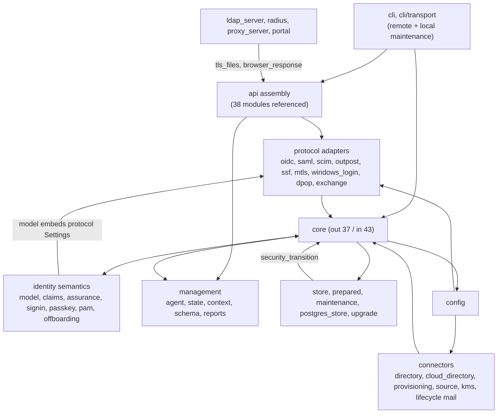
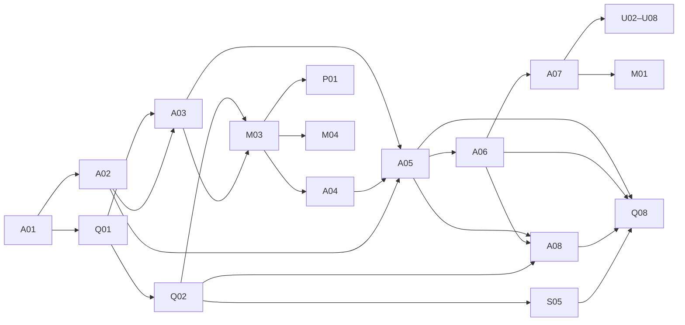

# Roadmap coverage inventory (A01)

Base revision `96e23e2` (2026-09-27). This page maps all 94 roadmap backlog IDs and the proposed product capabilities to the code, tests, documentation, and released artifacts that exist at that revision. Each row carries one label. [`coverage-inventory.json`](coverage-inventory.json) holds the same rows in machine-readable form, including every cited test function name and its CI status.

This is planning evidence, not a product claim. The edition assignments (Essentials, Platform, riauthctl) come from the roadmap boundaries and stay proposals until A02 freezes the contracts.

## How to read the labels

| Label | Meaning |
| --- | --- |
| **preserve** | Behavior exists, is regression-tested, and meets the item; the work is to keep it intact through refactors and lift its tests into shared contracts. |
| **extend** | A meaningful implementation exists, but the item needs more surface, interfaces, or limits removed. |
| **build** | Little or no implementation exists; the item needs new design and code. |
| **verify** | An implementation exists; what is missing is acceptance evidence (conformance, real peers, tenants, hardware), not code. |

The journey level separates a module or endpoint from a complete user or operator journey:

| Journey | Meaning |
| --- | --- |
| `none` | Nothing usable. |
| `module` | An endpoint, module, or API exists; no complete user or operator journey. |
| `partial` | The journey completes, but only through some interfaces (for example terminal only) or with documented gaps. |
| `complete-local` | The complete journey is exercised by local tests or fixtures; real-peer evidence is still separate. |
| `process` | Process or documentation item; journey not applicable. |

### Evidence rules

- **Tests existing vs. tests run.** Test names come from `#[test]`/`#[tokio::test]` attributes: 388 Rust test functions, 9 of them `#[ignore]`. **No tests were run for this inventory.** Every cited test is "existing", never "passed here".
- **CI status** of a cited test: *ci-check* means it is selected by `cargo test --all-targets --features test-support,fuzzing` in the Public CI check job. *CI integration* means an `#[ignore]` test run with an external program (Chrome, nginx, Traefik, OpenLDAP, PostgreSQL, xmlsec1). *not in CI* means present but not invoked by any workflow; this applies to the Playwright project in `tools/browser/`.
- **Released artifacts.** The only release tag is `v0.1.1` (`5ef0261`), an ancestor of the base; the base itself is an unreleased dependency refresh. The release pipeline was read. Published assets were not inspected.
- **Real peers.** Local fixtures and mocks are not counted as peer evidence. Rows say which peers CI actually starts.

## Summary

Backlog items: **4 preserve · 47 extend · 38 build · 5 verify** (94). Product capabilities: 3 preserve · 19 extend · 4 build · 5 verify (31).

| Workstream | Items | preserve | extend | build | verify |
| --- | --- | --- | --- | --- | --- |
| A — Architecture and separate builds | 9 | · | 2 | 7 | · |
| U — Complete browser account experience | 10 | · | 8 | 2 | · |
| M — Administration and controlled changes | 7 | · | 4 | 3 | · |
| W — Configurable workflows and policies | 7 | 1 | 1 | 5 | · |
| P — Provisioning and lifecycle automation | 8 | · | 6 | 2 | · |
| I — Protocols, connectors, and devices | 10 | · | 4 | 3 | 3 |
| S — Storage and scaling | 6 | 1 | 4 | 1 | · |
| O — Deployment, availability, and operations | 7 | 1 | 5 | 1 | · |
| R — Backup and recovery | 5 | · | 3 | 2 | · |
| G — Migration | 5 | · | 3 | 2 | · |
| Q — Security, testing, benchmarks, and releases | 11 | 1 | 4 | 4 | 2 |
| D — Documentation and product acceptance | 5 | · | 3 | 2 | · |
| X — Demand-driven extensions | 4 | · | · | 4 | · |

Journey levels: `complete-local` 7, `module` 37, `none` 26, `partial` 23, `process` 1.

## Biggest verified gaps

1. **No edition mechanism.** The only Cargo features are `test-support` and `fuzzing`. One build compiles every protocol. `agent::capabilities()` returns a fixed feature list, and OIDC discovery is static except for the certificate ACR. A02, A05, A06, and Q08 all start from zero. (`Cargo.toml, src/agent.rs, src/oidc.rs`)
2. **Module cycles block real boundaries.** `core` has 37 outgoing and 43 incoming references. `store` calls identity revocation code. `model` embeds protocol settings. `config` aggregates every connector. Listeners call into `api`. See the dependency map below. (`src/core.rs, src/store.rs, src/model.rs, src/config.rs`)
3. **Server and client are one binary.** The server links `webauthn-authenticator-rs` (usb, ui-cli) and `rpassword`, and the image installs `libudev1`. Local maintenance commands open storage directly. (`Cargo.toml, Dockerfile, src/cli.rs`)
4. **Browser self-service is terminal-bound.** Invitations, email verification, password change and recovery, TOTP and recovery codes, sessions and consent, device-flow approval, and source linking all need the CLI. `GET /device` returns a CLI instruction, and self-service APIs accept only an `Authorization` bearer. (`docs/lifecycle.md, src/api.rs`)
5. **No human administration model or GUI.** Human authority is `admin: bool`. There is no admin UI beyond the read-only `/events` map. Several separate plan/apply engines exist instead of one management service. (`src/model.rs, src/state.rs, src/directory.rs, src/cloud_directory.rs, src/provisioning.rs`)
6. **Offboarding stops at local revocation.** Jobs always report `downstream: local-only`. A test asserts that configured SCIM targets are not called. (`src/offboarding.rs, tests/offboarding.rs`)
7. **Global revision as the concurrency token.** SCIM ETags and agent `If-Match` both use one configuration revision, so unrelated changes stale every client. (`src/scim.rs, src/context.rs`)
8. **Backup and restore limits.** The backup response is buffered in memory up to 64 MiB. Restore always creates a new redb store; PostgreSQL needs a separate offline migration. (`src/operations.rs`)
9. **Release evidence is thin.** Linux x86_64 only. The smoke test runs `--json capabilities` only, and nothing is signed (provenance is explicitly not an attestation). The Playwright project, including the axe and Firefox/WebKit runs, is not wired into CI. (`.github/workflows/release.yml, .github/workflows/ci.yml`)
10. **No shared threat model or contract harness.** No document covers threat models or trust boundaries. Tests are rich but scenario-bound to one `Core` over redb; PostgreSQL has a single ignored integration test. (`docs/, tests/postgres.rs`)

## Architectural dependency map

### Current structure (measured)

One crate builds the `riauth` library and binary. The graph below groups the 60 top-level modules; arrows are `crate::` references counted from the source. Per-module counts are in `dependency_map.current_module_graph` in the JSON.

### Verified couplings to resolve in A03

| Edge | Where | Why it matters |
| --- | --- | --- |
| `store -> core, ssf` | src/store.rs security_transition calls crate::core::user_security_transition and crate::ssf::enqueue | Storage layer carries identity revocation semantics (INV-1); A03 must relocate without changing them |
| `model -> portal, saml, radius, ldap_server` | src/model.rs client settings embed crate::portal::Settings, crate::saml::Settings, crate::radius::Settings, crate::ldap_server::Settings | Shared model cannot compile without protocol adapters; blocks A05 feature gating |
| `config -> cloud_directory, directory, provisioning, radius, ldap_server, proxy_server, kms, mtls, device_trust, lifecycle, postgres_store` | src/config.rs Config struct | Config aggregates every module; A06 needs per-capability sections that can be rejected when not compiled |
| `ldap_server, proxy_server, portal -> api` | crate::api::tls_files and crate::api::browser_response | Protocol listeners depend on HTTP server assembly |
| `crypto -> config, kms, authenticator, jose` | src/crypto.rs | Crypto primitives depend on configuration and the Vault signer |
| `core <-> 37 modules` | src/core.rs (out 37, in 43) | God module; identity core boundary must be carved out of it |
| `cli -> api, core, operations, postgres_store, migration, passkey` | src/cli.rs | Client links server code; A04 needs the remote/local split first |
| `server binary -> webauthn-authenticator-rs (usb, ui-cli), rpassword; image -> libudev1` | Cargo.toml, Dockerfile | Server ships terminal/USB dependencies |

### Roadmap prerequisites

The longest prerequisite chain in the backlog is A01 → A02 → A03 → M03 → A04 → A05 → A06 → A07 → U03 → U08 → U10 → Q06 → D05. One valid phase-1 foundation order is A01 → Q01 → A02 → Q02 → A03 → M03 → A04 → A05 → A06 → S05 → A08 → Q08. Of the 42 U, M, W, P, and I items, 41 depend (directly or transitively) on A03 and 41 on Q02; 34 depend on M03 and 19 on A06. A03 and Q02 therefore carry the schedule.

## Invariants to preserve through refactoring

These behaviors already hold and have tests. A03–A06 must keep them, and Q01/Q02 should adopt them as the first shared contracts.

| ID | Invariant | Location | Existing tests |
| --- | --- | --- | --- |
| INV-1 | Disabling a user durably revokes child agents, Windows devices and tickets, queues RP logout and SSF; re-enable never restores them | `src/store.rs + src/core.rs (security_transition hook)` | `disable_entry_points_revoke_dependents_and_enqueue_exactly_once` `reenabling_legacy_disabled_accounts_never_restores_child_credentials` `disable_then_enable_never_resurrects_user_or_client_tokens` |
| INV-2 | Authentication proofs are single-use and bound to the request and session | `src/signin.rs, src/browser.rs` | `proof_is_single_use_and_bound_to_request_and_session` `proof_cannot_be_moved_between_identical_requests` |
| INV-3 | One-time codes and tokens have exactly one winner; replay revokes the family | `src/oidc.rs` | `concurrent_code_redemption_has_exactly_one_winner` `refresh_rotation_replay_revokes_the_entire_family` |
| INV-4 | Prepared authentication revalidates revocation and authority before commit | `src/store/prepared.rs` | `prepared_authentication_does_not_hold_the_writer_and_rechecks_revocation` `prepared_authority_expiring_during_signing_is_rechecked_before_commit` |
| INV-5 | Agents cannot create or modify administrators; the last administrator is preserved | `src/core.rs, src/agent.rs` | `last_administrator_is_preserved` `agent_credentials_enforce_action_resource_and_identity_boundaries` |
| INV-6 | Upstream identities never link by email or username; linking is explicit | `src/source.rs, src/cloud_directory.rs` | `oauth_only_sources_use_pinned_userinfo_and_do_not_invent_oidc_assurance_or_link_by_email` `unrelated_usernames_and_administrators_are_not_linked` |
| INV-7 | Temporary grants never change durable membership | `src/pam.rs` | `directory_projections_stay_durable_through_grant_expiry_and_revocation` |
| INV-8 | Policy is re-evaluated at refresh, userinfo and proxy, not only at issuance | `src/claims.rs, src/outpost.rs` | `group_policy_is_checked_again_at_refresh_userinfo_and_proxy` `updated_default_acr_rejects_userinfo_introspection_and_proxy_consistently` |
| INV-9 | Configuration rejects unknown keys (no silently ignored configuration) | `src/config.rs (deny_unknown_fields)` | `config_rejects_unknown_rate_limit_categories` |
| INV-10 | Schema upgrades are atomic and future schema versions are refused | `src/upgrade.rs` | `schema_upgrade_is_atomic_preserves_credentials_and_rejects_future_versions` |

## Released artifacts

The release workflow runs only on `v*` tags pointing at `main`. It reuses the full CI (check, integration, audit), asserts an x86_64 runner, and produces `riauth-linux-x86_64.tar.gz`, `riauth-linux-x86_64.docker.tar.gz`, `build-provenance.json`, `SHA256SUMS` as a **draft** release. Smoke checks: docker run IMAGE --json capabilities; THIRD_PARTY_NOTICES.md equality in image and tarball; LICENSE equality in tarball; libssl3t64 and libudev1 copyright files present; sha256sum --check. There are no ARM64, client-only, or maintenance artifacts, and no signatures or SBOM. The latest tag is `v0.1.1`; the base revision is not released. The published v0.1.1 assets were not inspected (no network access used).

## Product capabilities

| ID | Capability | Proposed edition | Label | Implementation | Tests (existing) | Docs | Backlog |
| --- | --- | --- | --- | --- | --- | --- | --- |
| C01 | OIDC/OAuth provider incl. advanced profiles | essentials | **verify** | `oidc.rs`, `jose.rs`, `dpop.rs`, `exchange.rs`, `registration.rs` | `tests/identity/oidc.rs` `tests/browser_signin.rs` | `oidc-profiles.md` | I01, A06, Q03 |
| C02 | Passkeys (browser and terminal) | essentials | **extend** | `passkey.rs`, `portal/http.rs` | `tests/portal.rs` `tests/identity/factors.rs` | `passkeys.md` | U03, U09, A04 |
| C03 | Password, TOTP and recovery codes | essentials | **extend** | `authenticator.rs`, `signin.rs`, `password_history.rs` | `tests/identity/factors.rs` `tests/password_history.rs` | `lifecycle.md`, `enterprise/ENT-08.md` | U04, U05 |
| C04 | Browser sign-in, SSO session, consent, RP logout | essentials | **preserve** | `browser.rs`, `signin.rs`, `api/interaction.rs`, `portal/signin.js` | `tests/signin_core.rs` `tests/browser_signin.rs` | `PORTAL.md`, `architecture.md` | W03, Q05 |
| C05 | Complete browser self-service (invite, verify, recover, factors, sessions, consent, device approval) | essentials | **extend** | `lifecycle.rs`, `api.rs` | `tests/identity/factors.rs` | `lifecycle.md` | U01, U02, U04, U05, U06, U07, U08 |
| C06 | Application portal | essentials | **preserve** | `portal.rs`, `portal/http.rs`, `portal/app.js` | `tests/portal.rs` `tests/portal_browser.rs` | `PORTAL.md` | A07 |
| C07 | Compact administration GUI | essentials | **build** | — | — | — | M01, M02, A07 |
| C08 | Groups, claims, scope/group/assurance policy | essentials | **extend** | `claims.rs`, `assurance.rs`, `authorization.rs`, `provider.rs` | `tests/identity/policy.rs` | `oidc-profiles.md` | W04, M06 |
| C09 | Management API/CLI, scoped agents, desired state | essentials | **extend** | `api.rs`, `agent.rs`, `state.rs`, `context.rs`, `cli.rs` | `tests/identity/operations.rs` `tests/cli.rs` | `agent.md`, `api.md` | M03, M07, S04 |
| C10 | Audit review, CSV export | essentials | **preserve** | `reports.rs` | `tests/reports.rs` | `enterprise/ENT-09.md`, `enterprise/ENT-15.md` | Q02 |
| C11 | Encrypted backup and restore | essentials | **extend** | `operations.rs` | `tests/operations.rs` | `operations.md` | R01, R02, R03, R04, R05 |
| C12 | LDAP import (synchronization) and LDAP password authentication | essentials | **verify** | `directory.rs` | `tests/ldap.rs` | `ldap.md` | I04, P01, P03 |
| C13 | Outbound SCIM provisioning | essentials | **extend** | `provisioning.rs` | `tests/scim_oauth.rs` | `scim.md`, `enterprise/ENT-12.md` | P01, P02, P04, P08 |
| C14 | Storage: redb and PostgreSQL | essentials | **extend** | `store.rs`, `postgres_store.rs`, `upgrade.rs` | `tests/storage.rs` `tests/postgres.rs` | `availability.md` | S05, S06, O02, O04 |
| C15 | Operations: probes, metrics, native TLS, alerts, rate limits | essentials | **extend** | `api/probes.rs`, `api/observability.rs`, `telemetry.rs`, `api/rates.rs` | `tests/operations.rs` `tests/rate_limits.rs` `tests/worker_capacity.rs` | `operations.md`, `enterprise/PLATFORM-04.md` | O05, O06 |
| C16 | Authentik migration | essentials | **extend** | `migration.rs` | `tests/identity/operations.rs` | `migration.md` | G01, G02, G03 |
| C17 | Configurable workflows (today: one source stage) | platform | **build** | `source.rs` | `tests/source_stage.rs` | `enterprise/ENT-11.md` | W01, W02, W05, W06, W07 |
| C18 | SAML IdP, SAML source and SAML logout | platform | **verify** | `saml.rs`, `saml/wire.rs`, `saml/logout.rs`, `source/saml.rs` | `tests/identity/saml.rs` `tests/identity/saml_logout.rs` `tests/identity/saml_source.rs` | `saml.md` | I04, X01 |
| C19 | LDAP provider (read-only listener) | platform | **verify** | `ldap_server.rs` | `tests/identity/network.rs` | `ldap-provider.md` | I04, X02 |
| C20 | RADIUS PAP, RadSec, EAP-TLS | platform | **verify** | `radius.rs`, `radius/eap.rs` | `tests/identity/network.rs` `tests/identity/radius_eap.rs` | `radius.md` | I04, X02 |
| C21 | Inbound SCIM server | platform | **extend** | `scim.rs` | `tests/identity/http.rs` | `scim.md` | P05, P06 |
| C22 | Shared Signals push (transmitter and receiver) | platform | **extend** | `ssf.rs` | `tests/ssf.rs` | `enterprise/ENT-07.md` | X03 |
| C23 | Forward auth and embedded reverse proxy | platform | **extend** | `outpost.rs`, `proxy_server.rs` | `tests/outpost.rs` `tests/outpost_traefik.rs` | `proxy.md` | I03, X04 |
| C24 | Upstream federation sources and explicit linking | platform | **extend** | `source.rs`, `source/saml.rs` | `tests/identity/sources.rs` `tests/source_stage.rs` | `oidc-profiles.md`, `enterprise/ENT-11.md` | I02, U08 |
| C25 | Cloud directories: Google Workspace, Microsoft Entra ID | platform | **extend** | `cloud_directory.rs` | `tests/cloud_directory.rs` | `enterprise/ENT-03.md`, `enterprise/ENT-04.md` | I05, I06, P03 |
| C26 | Device integrations: device trust, Windows login protocol, HTTPS client certificates | platform | **build** | `device_trust.rs`, `windows_login.rs`, `mtls.rs` | `tests/device_trust.rs` `tests/windows_login.rs` `tests/mtls.rs` | `enterprise/ENT-05.md`, `enterprise/ENT-06.md`, `enterprise/ENT-13.md` | I07, I08 |
| C27 | Temporary access, parent-owned agents, scheduled offboarding | platform | **extend** | `pam.rs`, `agent.rs`, `offboarding.rs` | `tests/pam.rs` `tests/agent_parent.rs` `tests/offboarding.rs` | `enterprise/ENT-01.md`, `enterprise/ENT-02.md`, `enterprise/ENT-10.md` | I09, P04 |
| C28 | Expanded administration: delegated roles, reviewed changes, event map, external signing | platform | **extend** | `event_map.rs`, `kms.rs` | `tests/event_map.rs` | `enterprise/ENT-14.md`, `kms.md` | M04, M05, M06 |
| C29 | riauthctl remote administration client | riauthctl | **build** | `cli.rs`, `cli/transport.rs` | `tests/cli.rs` | `agent.md`, `architecture.md` | A04 |
| C30 | Optional terminal USB authenticator | riauthctl | **extend** | `passkey.rs` | — | `passkeys.md` | A04 |
| C31 | Local maintenance (init, restore, recover-admin, migrate-postgres, import) | separate server maintenance (both builds) | **extend** | `cli.rs`, `operations.rs`, `migration.rs` | `tests/operations.rs` `tests/cli.rs` | `operations.md`, `migration.md` | A04, U01, R02 |

## Backlog items

Implementation and doc paths are relative to `src/` and `docs/` unless shown otherwise. Tests list files; the JSON has each test function name.

### A — Architecture and separate builds

| ID | Item | P | Label | Journey | Current state | Implementation | Tests (existing) | Docs | Main gaps |
| --- | --- | --- | --- | --- | --- | --- | --- | --- | --- |
| A01 | Inventory existing coverage | P0 | **build** | `process` | Delivered by this change: this inventory plus the JSON twin. Before this change the repository had no mapping of features to tests, docs, and artifacts. | — | — | `roadmap/coverage-inventory.md`, `roadmap/coverage-inventory.json` | Needs orchestrator review; rows reflect base 96e23e2 only |
| A02 | Freeze the two product contracts | P0 | **build** | `none` | No Essentials/Platform concept exists anywhere in source, docs, or Cargo features. Cargo features are only `test-support` and `fuzzing`. The capabilities list advertises every feature unconditionally. | `Cargo.toml`, `agent.rs` | — | `README.md`, `limitations.md` | No edition definitions, defaults, or measurable targets; Edition assignments in this inventory are proposals from the backlog boundaries, not contracts |
| A03 | Establish real module boundaries | P0 | **build** | `none` | A single crate with 60 flat `pub mod`s. The measured module graph has cycles: `core` references 37 modules and is referenced by 43. `store` calls identity code (`core::user_security_transition`, `ssf::enqueue`). The shared model embeds protocol settings (`portal`, `saml`, `radius`, `ldap_server`), and listeners call into the HTTP assembly (`api::tls_files`, `api::browser_response`). | `lib.rs`, `core.rs`, `store.rs`, `model.rs`, `config.rs`, `crypto.rs`, `ldap_server.rs`, `proxy_server.rs` | — | `architecture.md` | Cycles among core/store/model/config; Protocol settings types live in the shared model and config; The store-level security transition hook must keep its semantics when moved |
| A04 | Separate riauthctl | P0 | **build** | `partial` | The CLI is compiled into the same `riauth` binary as the server. The server's dependency set includes `webauthn-authenticator-rs` (usb, ui-cli) and `rpassword`, and the server container installs `libudev1`. Local maintenance commands (`init`, `restore`, `recover-admin`, `migrate-postgres`, `import-authentik`) open storage directly in the same binary. The remote transport is already a separable asset. | `main.rs`, `cli.rs`, `cli/transport.rs`, `passkey.rs`, `Cargo.toml`, `Dockerfile` | `tests/cli.rs` | `architecture.md`, `passkeys.md`, `agent.md` | No separate client crate/binary; USB/HID dependencies and libudev ship in the server image; Local maintenance is not isolated from remote administration |
| A05 | Implement two official server builds | P0 | **build** | `none` | One release build (`cargo build --release --locked`) with no capability features. Every protocol module is compiled unconditionally. | `Cargo.toml`, `.github/workflows/release.yml`, `Dockerfile` | — | `release-notes.md` | No optional dependencies or additive capability features; No second build definition |
| A06 | Separate compiled, enabled, and configured capabilities | P0 | **build** | `module` | `agent::capabilities()` returns a fixed feature list regardless of compilation or configuration. OIDC discovery is static except for the certificate ACR. One reusable asset: `Config` and its sections use `deny_unknown_fields`, so unknown keys are already rejected rather than ignored. | `agent.rs`, `oidc.rs`, `config.rs`, `api.rs` | `tests/rate_limits.rs` `tests/mtls.rs` `src/config.rs` | `api.md`, `oidc-profiles.md` | Advertisement does not distinguish compiled / enabled / configured; No rejection of configuration for an unavailable module (no such state exists yet) |
| A07 | Share the browser interfaces | P1 | **extend** | `partial` | Embedded portal assets (user application portal, sign-in/consent/logout interaction pages, and the admin `/events` map) with no frontend build. There is no administration UI, no capability-aware navigation, and no headless mode: portal routes are always mounted. | `portal.rs`, `portal/http.rs`, `portal/index.html`, `portal/signin.html`, `portal/events.html`, `api/interaction.rs` | `tests/portal.rs` `tests/browser_signin.rs` `tests/portal_browser.rs` (CI integration) | `PORTAL.md` | No shared admin components; No capability-aware navigation; No option to omit the browser UI |
| A08 | Make build transitions safe | P0 | **build** | `module` | Assets exist: schema upgrade is atomic and rejects future versions, and the issuer cannot change silently across restarts. No build or edition identity is stored, so there is nothing to block an unsafe edition switch or downgrade. | `upgrade.rs`, `store/maintenance.rs` | `tests/identity/operations.rs` | `operations.md`, `release-notes.md` | No persisted build/capability identity; No downgrade or policy-weakening guard across editions |
| A09 | Package supported architectures | P1 | **extend** | `partial` | The release workflow builds only Linux x86_64 (`test "$(uname -m)" = x86_64`): a native tarball plus a `docker save` image archive, SHA256SUMS, and build provenance. There is no ARM64, client-only, or maintenance artifact. *Unverified:* Whether the v0.1.1 draft release was published, and its asset contents. | `.github/workflows/release.yml`, `scripts/package-release.sh`, `Dockerfile` | — | `release-notes.md`, `operations.md` | No ARM64; No separate client or maintenance artifacts; Artifacts are smoke-tested only by `--json capabilities` and notice comparison |

### U — Complete browser account experience

| ID | Item | P | Label | Journey | Current state | Implementation | Tests (existing) | Docs | Main gaps |
| --- | --- | --- | --- | --- | --- | --- | --- | --- | --- |
| U01 | Add secure browser bootstrap | P0 | **build** | `none` | The first administrator is created only by `riauth init` in a terminal with a password (`Core::initialize`). There is no browser bootstrap or ownership-verified setup token. | `cli.rs`, `core.rs` | `tests/cli.rs` | `getting-started.md`, `README.md` | No browser setup flow; No single-use ownership proof |
| U02 | Complete invitations and email verification | P1 | **extend** | `partial` | Invitation and email-verification backends exist with scoped authority, single use, and epoch binding. Acceptance and verification are CLI-only: emails carry a code and a terminal command, and there is no hosted form. | `lifecycle.rs`, `api.rs`, `cli.rs` | `tests/identity/factors.rs` `tests/ssf.rs` | `lifecycle.md` | No browser invitation/verification pages; Link design against mail-scanner prefetch not present (codes, not links) |
| U03 | Complete passkey management | P1 | **extend** | `partial` | The portal lists, adds, and removes passkeys, with fresh-MFA rules and sign-out-everywhere on change. Browser passkey sign-in is discoverable and pinned. There is no rename, and cancellation and multiple-authenticator journeys are only partly covered. *Unverified:* Results of the Playwright passkey specs (not run in CI or for this inventory). | `passkey.rs`, `portal/http.rs`, `portal/app.js`, `portal/auth.js` | `tests/portal.rs` `tests/identity/factors.rs` `tools/browser/signin.spec.js` (not in CI) | `passkeys.md`, `PORTAL.md` | No rename; Physical authenticators untested (soft/virtual only) |
| U04 | Add browser password change and recovery | P1 | **extend** | `module` | The backend supports self password change (`POST /api/password`, bearer only) and email reset that preserves factors. Both are terminal-only; there is no browser page. Password history is enforced. | `api.rs`, `lifecycle.rs`, `password_history.rs` | `tests/identity/factors.rs` `tests/password_history.rs` | `lifecycle.md`, `enterprise/ENT-08.md` | No browser change/recovery flow; Self-service APIs require an Authorization bearer, not the SSO cookie |
| U05 | Add browser TOTP and recovery-code management | P1 | **extend** | `module` | TOTP enrollment and confirmation plus recovery-code rotation exist via `/api/mfa/*` (bearer) and the CLI. The portal cannot manage them (PORTAL.md: authenticator apps are managed from the terminal). | `authenticator.rs`, `api.rs` | `tests/identity/factors.rs` `tests/signin_core.rs` | `lifecycle.md`, `PORTAL.md` | No browser enrollment, replacement, removal, or rotation |
| U06 | Add session and consent self-service | P1 | **extend** | `module` | Session list and revoke (`/api/sessions`) and consent list exist for bearer callers and the CLI. The portal offers only sign-out of the current browser. | `api.rs`, `core.rs` | `tests/signin_core.rs` `tests/identity/network.rs` `tests/identity/policy.rs` | `lifecycle.md`, `PORTAL.md` | No browser session/consent list; No browser sign-out-everywhere or consent withdrawal |
| U07 | Complete browser device-flow approval | P1 | **extend** | `module` | The device grant is implemented and tested. `GET /device` returns JSON telling the user to run `riauth device approve`. The approval API (`/api/device/{code}`, `/api/device/decision`) is bearer-only. | `oidc.rs`, `api.rs` | `tests/identity/oidc.rs` | `oidc-profiles.md`, `lifecycle.md` | No browser review/approve page |
| U08 | Complete browser upstream authentication | P2 | **extend** | `partial` | Source stages (ENT-11) complete an upstream login inside a browser authorization. Standalone source sign-in and explicit link/unlink remain terminal (`riauth source start/finish`). | `source.rs`, `source/saml.rs`, `browser.rs` | `tests/source_stage.rs` `tests/identity/sources.rs` | `enterprise/ENT-11.md`, `oidc-profiles.md`, `lifecycle.md` | No browser linking/unlinking; No standalone browser source login |
| U09 | Support passkey-only administrators | P1 | **build** | `none` | Administrators are created and recovered with passwords (`init`, `recover-admin --password-stdin`). Passkeys can be added later, but no journey or test covers a passkey-only administrator or an independent backup credential. | `cli.rs`, `core.rs`, `passkey.rs` | `tests/identity/policy.rs` | `enterprise/ENT-13.md`, `operations.md` | No passkey-only admin creation; Emergency recovery is password-based and requires the server stopped |
| U10 | Validate accessibility and mobile usability | P1 | **extend** | `partial` | Playwright specs run axe (WCAG 2.1 AA tags), a keyboard-only journey, a 390px viewport, and 200% text. The cargo portal browser test checks 320–1440px layout. Only existing sign-in and portal pages are covered; the U02–U09 journeys do not exist yet. *Unverified:* Firefox/WebKit Playwright results. | `tools/browser/signin.spec.js`, `tools/browser/portal.spec.js`, `tools/browser/playwright.config.js` | `tools/browser/signin.spec.js` (not in CI) `tools/browser/portal.spec.js` (not in CI) `tests/portal_browser.rs` (CI integration) | `PORTAL.md`, `architecture.md` | No assistive-technology (screen reader) testing; Playwright project is not invoked by CI (only hygiene and Dependabot reference tools/browser) |

### M — Administration and controlled changes

| ID | Item | P | Label | Journey | Current state | Implementation | Tests (existing) | Docs | Main gaps |
| --- | --- | --- | --- | --- | --- | --- | --- | --- | --- |
| M01 | Build the compact administration interface | P1 | **build** | `none` | There is no administration GUI. The only admin page is the read-only `/events` map. Administration is the CLI and HTTP API. | `portal/events.html`, `api.rs` | `tests/event_map.rs` | `PORTAL.md`, `api.md` | Entire compact admin UI |
| M02 | Add application setup wizards | P1 | **build** | `none` | No setup wizard. Related assets: registration templates (`GET /api/registration`), portal launch metadata, and client create/update APIs. | `registration.rs`, `portal.rs` | `tests/identity/oidc.rs` | `getting-started.md`, `oidc-profiles.md` | Wizards; Connection diagnostics |
| M03 | Use one management service everywhere | P0 | **extend** | `partial` | Remote CLI commands go through HTTP to `Core`. Imperative writes share `Core::mutation` (principal, idempotency receipt, If-Match revision, audit), and desired state uses `state.rs` plan/apply. But there are several write engines (imperative, state, LDAP/cloud directory, outbound SCIM, SCIM inbound), and local CLI commands (`recover-admin`, `restore`, `init`, `migrate-postgres`) bypass the API. | `context.rs`, `core.rs`, `state.rs`, `api.rs`, `cli.rs`, `cli/transport.rs` | `tests/identity/operations.rs` `tests/identity/policy.rs` | `agent.md`, `api.md` | No single management service; multiple plan/apply implementations; GUI does not exist, so GUI/CLI/API parity is untestable |
| M04 | Add delegated human administration | P2 | **build** | `none` | Human authority is a single `admin: bool`. Agents have scoped action/resource permissions, but the architecture guide states these do not grant administrator delegation. | `model.rs`, `agent.rs` | `tests/identity/operations.rs` | `agent.md`, `architecture.md` | Human role model (help-desk, app owner, directory operator, auditor, security admin) |
| M05 | Add reviewed changes and multi-party approval | P2 | **extend** | `module` | Plans are immutable, actor-bound, and revision-bound. A group wipe needs a plan-ID header. PAM separates requester from approver. There is no generic multi-party approval and no author/reviewer/executor split. | `state.rs`, `pam.rs`, `cloud_directory.rs` | `tests/identity/operations.rs` `tests/pam.rs` `tests/cloud_directory.rs` | `agent.md`, `enterprise/ENT-01.md` | Multi-party approval bound to exact content; Reviewer/executor roles |
| M06 | Expose policy explanations and safe simulation | P2 | **extend** | `module` | `POST /api/policy/explain` and `riauth explain` simulate a username-based decision for one client without a session proof. Device trust reports that a session is required. *Unverified:* Explain output completeness across sources and ACR. | `claims.rs`, `api.rs`, `cli.rs` | `tests/pam.rs` `tests/device_trust.rs` | `enterprise/ENT-06.md`, `oidc-profiles.md` | Explanations are per user and client only; no what-if for pending changes; No dedicated explain test; exercised inside PAM and device-trust tests |
| M07 | Extend desired-state coverage | P2 | **extend** | `partial` | The desired-state manifest covers users, groups, clients, sources, and source_links (`api_version`, JSON Schema). Workflows, roles, connectors, PAM approvers, and listeners live only in `riauth.toml`. | `state.rs`, `schema.rs`, `resource.rs` | `tests/identity/operations.rs` `tests/identity/sources.rs` | `agent.md` | Connectors, roles, workflows not manageable resources |

### W — Configurable workflows and policies

| ID | Item | P | Label | Journey | Current state | Implementation | Tests (existing) | Docs | Main gaps |
| --- | --- | --- | --- | --- | --- | --- | --- | --- | --- |
| W01 | Define a typed workflow model | P2 | **build** | `none` | No workflow model. The only configurable stage is a single optional `settings.source_stage` per client (ENT-11). | `source.rs` | — | `enterprise/ENT-11.md` | Typed workflow model |
| W02 | Build the server-side workflow executor | P2 | **build** | `none` | No executor. Source-stage suspend/resume/expiry/cancel is the nearest precedent. | `source.rs`, `browser.rs` | `tests/source_stage.rs` | `enterprise/ENT-11.md` | Executor with retries, resumable state, explicit transitions |
| W03 | Preserve authentication invariants | P0 | **preserve** | `complete-local` | The invariants already hold and are regression-tested: proofs are single-use and bound to request and session, cannot move between identical requests, and stages cannot invent assurance. The upstream account must match the bound link. Any workflow engine must keep these. | `signin.rs`, `browser.rs`, `session_protocol.rs`, `source.rs` | `tests/signin_core.rs` `tests/browser_signin.rs` `tests/source_stage.rs` `tests/identity/oidc.rs` | `architecture.md`, `enterprise/ENT-11.md` | Turn into a reusable contract suite (Q02) before any workflow work |
| W04 | Add conditional policies and claim mappings | P2 | **extend** | `module` | Per-client claim mappings, scope policies, group policy, default ACR/MFA, and required device trust exist and are rechecked at refresh, userinfo, and proxy. There is no conditional policy language (by source, freshness, or device signal combinations). | `claims.rs`, `assurance.rs`, `provider.rs`, `authorization.rs` | `tests/identity/operations.rs` `tests/identity/policy.rs` | `oidc-profiles.md` | Conditional policies |
| W05 | Version workflows safely | P2 | **build** | `none` | No workflow versioning. | — | — | — | All |
| W06 | Add templates and a visual editor | P2 | **build** | `none` | No templates or visual editor. | — | — | — | All |
| W07 | Define controlled extensions | P2 | **build** | `none` | No extension mechanism. `unsafe_code = forbid`; no scripting runtime. | `Cargo.toml` | — | — | All |

### P — Provisioning and lifecycle automation

| ID | Item | P | Label | Journey | Current state | Implementation | Tests (existing) | Docs | Main gaps |
| --- | --- | --- | --- | --- | --- | --- | --- | --- | --- |
| P01 | Unify reconciliation modes | P1 | **extend** | `partial` | There are four separate plan/apply engines: desired state (`state.rs`), LDAP sync (`directory.rs`), Workspace/Entra (`cloud_directory.rs`), and outbound SCIM (`provisioning.rs`). All are manual-review only; there is no guarded-automatic or automatic mode. | `state.rs`, `directory.rs`, `cloud_directory.rs`, `provisioning.rs` | `tests/cloud_directory.rs` `tests/scim_oauth.rs` `tests/ldap.rs` (CI integration) | `ldap.md`, `scim.md`, `enterprise/ENT-03.md`, `enterprise/ENT-04.md` | One engine; Automatic modes |
| P02 | Add scoped connector controllers | P2 | **build** | `module` | No connector scheduler or event-driven controller; the docs tell operators to schedule plan/apply externally. There is a reusable asset: the outbound SCIM worker has durable jobs, leases across restart and nodes, and authority revalidation. | `provisioning.rs`, `api/server.rs` | `tests/scim_oauth.rs` | `scim.md`, `ldap.md` | Schedules; Event-driven jobs for inbound connectors |
| P03 | Add removal safeguards | P0 | **extend** | `partial` | Cloud directories force review above thresholds (`REVIEW_DISABLE_COUNT=5`, 20%/50%) and on incomplete pagination. LDAP rejects partial or error results and makes an intentionally empty result a reviewable plan. Outbound SCIM stops an item on an ambiguous remote ID. *Unverified:* LDAP removal thresholds (only docs read). | `cloud_directory.rs`, `directory.rs`, `provisioning.rs` | `tests/cloud_directory.rs` | `enterprise/ENT-03.md`, `enterprise/ENT-04.md`, `ldap.md` | Uniform safeguards across all engines; LDAP large-removal threshold not found |
| P04 | Connect offboarding to downstream jobs | P0 | **build** | `partial` | Scheduled offboarding durably disables the user locally and cascades revocation. It never creates downstream jobs; its result is always `downstream: local-only`. | `offboarding.rs`, `core.rs` | `tests/offboarding.rs` | `enterprise/ENT-10.md` | Persist downstream delivery intent with the local revocation; Per-target outcome tracking |
| P05 | Improve ordinary SCIM-client compatibility | P1 | **extend** | `module` | The SCIM ETag is the global configuration revision (`meta.version`), and agent mutations require If-Match of that global revision, so unrelated changes stale an ETag. The docs say incompatible clients need an adapter. | `scim.rs`, `context.rs` | `tests/identity/http.rs` | `scim.md` | Resource-level versions |
| P06 | Complete the supported SCIM contract | P1 | **extend** | `module` | SCIM Users/Groups CRUD and PATCH exist. Limits: a single `eq` filter, no enterprise/custom schema, no nested groups, no bulk/sort, and immutable names. *Unverified:* Compatibility with any named SCIM client. | `scim.rs` | `tests/identity/http.rs` `src/provisioning.rs` | `scim.md` | Supported-client contract undefined (depends on A02); Filters, enterprise schema |
| P07 | Make large reconciliation bounded and resumable | P2 | **extend** | `module` | The limits are bounded but not resumable: outbound SCIM caps at 2,000 users and 2 MiB plans, LDAP at 2,000 users, 32 groups, and 4 MiB. Plans are whole-snapshot. | `provisioning.rs`, `directory.rs`, `cloud_directory.rs` | `tests/scim_oauth.rs` `tests/cloud_directory.rs` | `scim.md`, `ldap.md` | Pagination/bounded-memory processing beyond fixed caps; Resumable reconciliation |
| P08 | Expose reliable delivery outcomes | P1 | **extend** | `partial` | Jobs persist progress and errors. An uncertain PATCH is reconciled by reading back rather than patching again. Ambiguity stops an item for review. Delivery is documented as at-least-once. | `provisioning.rs` | `tests/scim_oauth.rs` `tests/identity/policy.rs` | `scim.md` | Operator reconciliation UI; Per-target outcome reporting for offboarding |

### I — Protocols, connectors, and devices

| ID | Item | P | Label | Journey | Current state | Implementation | Tests (existing) | Docs | Main gaps |
| --- | --- | --- | --- | --- | --- | --- | --- | --- | --- |
| I01 | Preserve and verify OAuth/OIDC capabilities | P0 | **verify** | `complete-local` | Broad OAuth/OIDC coverage exists: code+PKCE, refresh rotation, device, client credentials, private_key_jwt, token exchange, DPoP, PAR/JAR/JARM, JWE, pairwise, dynamic registration, and logout variants. It has 41 tests in `tests/identity/oidc.rs` plus the browser suites. A pinned OIDF runner exists, but no results are published, and discovery is static (see A06). *Unverified:* OIDF conformance outcome; Behaviour with named relying parties. | `oidc.rs`, `jose.rs`, `dpop.rs`, `exchange.rs`, `registration.rs`, `response.rs`, `logout.rs`, `scripts/run-conformance.py` | `tests/identity/oidc.rs` `tests/browser_signin.rs` `tests/browser.rs` (CI integration) | `oidc-profiles.md`, `limitations.md` | Discovery must follow enabled capabilities; Conformance results |
| I02 | Finish federation and trust management | P2 | **extend** | `partial` | OIDC/OAuth/SAML sources pin keys and link only explicitly (never by email); unlinking revokes only the linked sessions. Browser completion is partial (U08). There is no assurance-mapping configuration and no key-rotation journey. *Unverified:* Real upstream IdPs. | `source.rs`, `source/saml.rs` | `tests/identity/sources.rs` `tests/identity/saml_source.rs` (CI integration) | `oidc-profiles.md`, `saml.md` | Browser linking; Rotation journey; Assurance mapping |
| I03 | Complete integrated proxy behavior | P2 | **extend** | `complete-local` | Forward auth works for nginx and Traefik (real binaries in the CI integration job), and the embedded reverse proxy handles WebSocket origin checks and revocation. Routes are exact origins only; there are no path bypass or routing rules. *Unverified:* Behaviour with real protected applications. | `outpost.rs`, `proxy_server.rs`, `deploy/nginx-forward-auth.conf`, `deploy/traefik-forward-auth.yml` | `tests/outpost.rs` (CI integration) `tests/outpost_traefik.rs` (CI integration) `tests/identity/network.rs` | `proxy.md` | Bypass/routing rules; Backend isolation claims |
| I04 | Verify SAML, LDAP, and RADIUS profiles | P2 | **verify** | `complete-local` | SAML is checked against independent xmlsec1 (CI integration). LDAP sync runs against a real OpenLDAP (`scripts/test-ldap.sh`). RADIUS EAP-TLS is checked against the OpenSSL client. The LDAP provider and RADIUS PAP/RadSec use local fixtures. No real SP, supplicant, or NAS peer has been used. *Unverified:* Any named SP, LDAP client, supplicant, or NAS. | `saml.rs`, `saml/wire.rs`, `saml/logout.rs`, `ldap_server.rs`, `directory.rs`, `radius.rs`, `radius/eap.rs`, `scripts/test-ldap.sh` | `tests/identity/saml.rs` (CI integration) `tests/identity/saml_logout.rs` (CI integration) `tests/ldap.rs` (CI integration) `tests/identity/radius_eap.rs` `tests/identity/network.rs` | `saml.md`, `ldap.md`, `ldap-provider.md`, `radius.md`, `limitations.md` | Real peers per supported profile |
| I05 | Add direct supported Google Workspace authorization | P2 | **build** | `module` | Workspace sync requires an operator-supplied token broker (`token_url`). There is no direct Google service-account/JWT authorization. Tests use local mocks only. *Unverified:* Real Workspace tenant. | `cloud_directory.rs` | `tests/cloud_directory.rs` | `enterprise/ENT-03.md` | Direct supported authorization |
| I06 | Complete Microsoft Entra integration | P2 | **verify** | `module` | Entra client_credentials (secret file reread per plan), Graph paging, membership, links, and removal review exist and are tested against local mocks only. There is no certificate credential. *Unverified:* Real Entra tenant. | `cloud_directory.rs` | `tests/cloud_directory.rs` | `enterprise/ENT-04.md` | Controlled-tenant validation; Certificate credentials/rotation |
| I07 | Implement real device-trust integrations | P2 | **build** | `module` | Device trust is a local stand-in: a locally signed JWT bound to session, epoch, and device, and it fails closed. It does not call Google Verified Access, and no managed Chrome has been tested (ENT-06). *Unverified:* Any managed device. | `device_trust.rs` | `tests/device_trust.rs` | `enterprise/ENT-06.md` | Vendor adapter; Provenance/freshness against managed devices |
| I08 | Ship a complete Windows login component | P2 | **build** | `module` | The server-side enrollment, login, and offline-ticket protocol exists. There is no credential provider, DLL, installer, or signed updates, and nothing has been tested on Windows (ENT-13). | `windows_login.rs` | `tests/windows_login.rs` | `enterprise/ENT-13.md` | Entire Windows component |
| I09 | Complete temporary-access and dependent-credential lifecycle | P2 | **extend** | `partial` | PAM request, approval, expiry, and revocation exist via API/CLI without changing durable membership. Parent-owned agents are revoked on parent disable. Windows devices are revoked by the disable cascade. There is no browser request/approval UI. | `pam.rs`, `agent.rs`, `windows_login.rs`, `core.rs` | `tests/pam.rs` `tests/agent_parent.rs` `tests/ssf.rs` | `enterprise/ENT-01.md`, `enterprise/ENT-02.md` | Browser request/approval; Delegated approver roles (M04) |
| I10 | Give every connector an operational interface | P2 | **extend** | `module` | Connectors have list, plan, and apply endpoints. Secret files are reread (with a rotation test), outbound SCIM exposes job history, and `doctor` and the delivery endpoints exist. There is no test-connection, no schedules, and no uniform job history or actionable error surface. | `api.rs`, `provisioning.rs`, `cloud_directory.rs`, `directory.rs`, `operations.rs` | `tests/scim_oauth.rs` `tests/cloud_directory.rs` | `scim.md`, `operations.md` | Test connection; Uniform connector status |

### S — Storage and scaling

| ID | Item | P | Label | Journey | Current state | Implementation | Tests (existing) | Docs | Main gaps |
| --- | --- | --- | --- | --- | --- | --- | --- | --- | --- |
| S01 | Measure contention first | P2 | **extend** | `module` | Telemetry already records `write_wait`, `write_hold`, `pool_wait`, signing, password, cleanup histograms, `scanned_records`, and `optimistic_conflicts`. There is no benchmark or contention-measurement harness. | `telemetry.rs`, `api/observability.rs` | `tests/operations.rs` | `operations.md` | Measurement methodology and baseline |
| S02 | Index and paginate expensive operations | P2 | **extend** | `module` | There are derived indexes (per-user grants, due work, five delivery queues), maintenance pages, and opaque inventory cursors. The docs note that several logical collections are still scanned. | `store/maintenance.rs`, `store.rs`, `resource.rs` | `tests/storage.rs` `tests/pam.rs` `tests/identity/operations.rs` | `architecture.md`, `availability.md` | Remaining scans; List pagination on admin reads |
| S03 | Narrow transaction contention where justified | P0 | **preserve** | `complete-local` | Authentication prepares expensive work outside the writer and revalidates before commit (`store/prepared.rs`). Management writes deliberately serialize (PostgreSQL uses an advisory lock). Keep this until S01 justifies narrowing. | `store/prepared.rs`, `store.rs`, `postgres_store.rs` | `tests/storage.rs` | `architecture.md`, `availability.md` | Any narrowing must be proven against Q05 |
| S04 | Add dependency-aware revisions | P2 | **build** | `module` | A single global `meta.revision` guards all conditional writes and SCIM ETags. There is no dependency-aware revision. | `context.rs`, `scim.rs`, `state.rs` | `tests/identity/oidc.rs` | `agent.md`, `scim.md` | Dependency-scoped revisions |
| S05 | Enforce equivalent backend contracts | P0 | **extend** | `partial` | One `Store`/`Tx` API sits over `Backend::{Redb, Postgres}`. Nearly all suites use redb fixtures. PostgreSQL has one ignored integration test (atomicity, shared sessions, replay, limits, migration, fenced failover) that runs in the CI integration job via `scripts/test-postgres.sh`. | `store.rs`, `postgres_store.rs`, `scripts/test-postgres.sh` | `tests/postgres.rs` (CI integration) `tests/storage.rs` | `availability.md` | Same contract suite run against both backends |
| S06 | Stream and verify migrations | P2 | **extend** | `module` | `migrate-postgres` requires an empty target, copies and compares every record, and keeps the source, but it materializes complete record maps in memory. | `operations.rs` | `tests/postgres.rs` (CI integration) | `availability.md` | Streaming; Interruption/retry semantics |

### O — Deployment, availability, and operations

| ID | Item | P | Label | Journey | Current state | Implementation | Tests (existing) | Docs | Main gaps |
| --- | --- | --- | --- | --- | --- | --- | --- | --- | --- |
| O01 | Support integrated and optional split roles | P2 | **extend** | `partial` | One process runs HTTP, the optional LDAP/RADIUS/proxy listeners, and all workers. There are no scoped worker or gateway roles. | `api/server.rs`, `ldap_server.rs`, `radius.rs`, `proxy_server.rs` | `tests/worker_capacity.rs` | `architecture.md`, `availability.md` | Split roles |
| O02 | Preserve single-owner embedded storage | P0 | **preserve** | `partial` | redb is owned by one process, and its file lock blocks concurrent opens. Listeners are in-process. The remote CLI uses HTTP. Multi-node deployments use PostgreSQL. Local maintenance commands open the store directly and rely on that lock. *Unverified:* No test found that asserts a second opener is refused. | `store.rs`, `cli.rs` | `tests/identity/operations.rs` | `availability.md` | Guard remains implicit (file lock) once components split |
| O03 | Coordinate multi-node configuration | P2 | **build** | `none` | Nothing detects capability or configuration mismatches between nodes (no source match). The docs require operators to coordinate `riauth.toml`, trust files, and restarts. The `forward_auth` rate limit is per node. | `store.rs` | `tests/rate_limits.rs` | `availability.md` | Mismatch detection; Shared-job/cache-freshness contract |
| O04 | Make upgrades and rollback explicit | P0 | **extend** | `partial` | Schema v3 upgrades atomically and rejects future versions. The documented procedure is: stop all older writers, back up, upgrade, and roll back by restore. There is no mixed-version operation or feature activation. | `upgrade.rs`, `store/maintenance.rs` | `tests/identity/operations.rs` `tests/operations.rs` | `operations.md`, `release-notes.md` | Mixed-version rules; Readiness gating on activation |
| O05 | Bound overload and isolate background work | P2 | **extend** | `complete-local` | The admission model is 8 worker permits, 4 credential permits, and 16 forward-auth permits, with a 2 s queue wait before 503. Probes bypass quotas. Background workers run sequential loops. Connector isolation from sign-in is not measured. | `api.rs`, `api/probes.rs`, `api/rates.rs`, `api/server.rs` | `tests/worker_capacity.rs` `tests/outpost_traefik.rs` `src/api/probes.rs` `tests/operations.rs` | `architecture.md`, `operations.md` | Background-job isolation evidence |
| O06 | Build operational dashboards and diagnostics | P2 | **extend** | `module` | Available now: Prometheus metrics, `doctor`, delivery endpoints (`/api/operations/logout`, `/mail`), an alert rules template, and an alert webhook. There are no dashboards, no connector-lag or node-mismatch signals, and incomplete offboarding is not surfaced. | `operations.rs`, `telemetry.rs`, `deploy/prometheus.yml`, `deploy/riauth-alerts.yml` | `tests/operations.rs` | `operations.md`, `enterprise/PLATFORM-04.md` | Dashboards; Connector/offboarding diagnostics |
| O07 | Publish tested deployment configurations | P2 | **extend** | `module` | Templates exist: Caddyfile, nginx and Traefik forward-auth configs, a systemd unit, Prometheus configuration and alerts, plus the Dockerfile. There is no compose, Kubernetes, or HA reference, and the templates are not tested as deployments. *Unverified:* Whether deploy/ templates match the fixtures used by outpost tests. | `deploy/Caddyfile`, `deploy/riauth.service`, `deploy/nginx-forward-auth.conf`, `deploy/traefik-forward-auth.yml`, `Dockerfile` | — | `operations.md`, `availability.md`, `proxy.md` | Tested distributed configurations |

### R — Backup and recovery

| ID | Item | P | Label | Journey | Current state | Implementation | Tests (existing) | Docs | Main gaps |
| --- | --- | --- | --- | --- | --- | --- | --- | --- | --- |
| R01 | Stream authenticated backups | P1 | **extend** | `module` | Backups are authenticated, encrypted v2 chunks from one snapshot. The whole ciphertext response is buffered in memory up to `MAX_BACKUP_BYTES` = 64 MiB. There is no streaming, cancellation, or progress reporting. | `operations.rs` | `tests/operations.rs` | `operations.md`, `limitations.md` | Streaming; Configurable quota; Progress/cancel |
| R02 | Restore directly into the selected backend | P1 | **extend** | `partial` | Restore always creates a new redb directory (`Store::open_with_key(... riauth.redb)`). PostgreSQL requires a later offline migrate. | `operations.rs` | `tests/operations.rs` `tests/identity/operations.rs` | `operations.md`, `availability.md` | Direct PostgreSQL restore; Pre-activation validation |
| R03 | Cover configuration and key custody | P1 | **extend** | `module` | The docs cover Vault Transit custody, database key files, secret files, and the need for separate recovery. There is no complete custody checklist tied to configuration. | `kms.rs`, `config.rs` | `tests/identity/operations.rs` | `kms.md`, `operations.md`, `testing.md` | Recovery inventory of external references |
| R04 | Define database-native recovery and restored-session policy | P0 | **build** | `module` | Restore preserves sessions, grants, and keys (tests assert this). No policy states which sessions, proofs, grants, or revocations must be invalidated when older state is restored. | `operations.rs` | `tests/operations.rs` | `operations.md` | Restored-session policy; Revocation-resurrection analysis |
| R05 | Automate recovery drills | P1 | **build** | `none` | No automated recovery drill. The PostgreSQL failover test and restore unit tests are components of a drill, not a drill. | `scripts/test-postgres.sh` | `tests/postgres.rs` (CI integration) | `testing.md`, `operations.md` | Drill harness and recorded outcomes |

### G — Migration

| ID | Item | P | Label | Journey | Current state | Implementation | Tests (existing) | Docs | Main gaps |
| --- | --- | --- | --- | --- | --- | --- | --- | --- | --- |
| G01 | Add migration preflight reporting | P2 | **extend** | `module` | The offline Authentik converter emits `report.json` with `blockers`, `unresolved`, and `ready_for_plan`, plus a manifest when ready. It does not use an exact/convertible/manual/unsupported classification. | `migration.rs`, `cli.rs` | `tests/identity/operations.rs` | `migration.md` | Four-way classification; Non-Authentik sources |
| G02 | Preserve verified identity continuity | P2 | **extend** | `partial` | Exported subjects, Django password hashes (verified and upgraded), and TOTP settings are preserved. Groups are flattened with cycle rejection. *Unverified:* Against a real Authentik export. | `migration.rs`, `state.rs` | `tests/identity/operations.rs` `tests/identity/factors.rs` | `migration.md` | Issuer/application continuity rehearsal |
| G03 | Convert only supported mappings and workflows | P2 | **extend** | `module` | Property mappings and flows without a reviewed declarative translation are blockers, not silently dropped. No workflow conversion exists (W01 absent). | `migration.rs` | `tests/identity/operations.rs` | `migration.md`, `limitations.md` | Tested conversions catalogue |
| G04 | Provide re-enrollment and user communication | P2 | **build** | `none` | There is no re-enrollment or user communication tooling. The docs state that passkeys, sessions, and opaque tokens do not transfer. | — | — | `migration.md`, `limitations.md` | All |
| G05 | Rehearse staged cutover per application | P2 | **build** | `none` | There is no staged-cutover harness. The testing guide lists manual checks. | — | — | `testing.md`, `migration.md` | All |

### Q — Security, testing, benchmarks, and releases

| ID | Item | P | Label | Journey | Current state | Implementation | Tests (existing) | Docs | Main gaps |
| --- | --- | --- | --- | --- | --- | --- | --- | --- | --- |
| Q01 | Define shared threat models and invariants | P0 | **build** | `none` | There is no threat-model or invariants document (no match for 'threat' in docs). Trust boundaries are scattered: proxy trust, mTLS via a trusted proxy, and ENT notes. The invariant table in this inventory is a starting point. | — | — | `architecture.md`, `operations.md`, `enterprise/ENT-05.md` | Documented shared threat model |
| Q02 | Build reusable contract tests | P0 | **extend** | `module` | Tests are extensive (388 test functions, 9 ignored) with shared fixtures (`tests/common/mod.rs`, `tests/common/security.rs`). They are scenario tests bound to one `Core` over redb, not reusable contracts parameterized by backend, build, or interface. | `tests/common/mod.rs`, `tests/common/security.rs` | `tests/storage.rs` `tests/signin_core.rs` `tests/identity/operations.rs` | `testing.md` | Parameterized contract harness (backend × edition × interface) |
| Q03 | Run relevant conformance suites | P2 | **verify** | `module` | A pinned OIDF suite runner exists (`scripts/run-conformance.py`, commit 440eec8b). Independent xmlsec1 SAML tests run in CI integration. No conformance results are published and no certification is claimed. *Unverified:* Any OIDF run outcome. | `scripts/run-conformance.py` | `tests/identity/saml.rs` (CI integration) `tests/identity/oidc.rs` | `limitations.md`, `testing.md` | Run and publish scoped results |
| Q04 | Test real peers | P2 | **verify** | `partial` | Real peers in CI integration are PostgreSQL (replicated), OpenLDAP, nginx, Traefik v3.7.13, xmlsec1, and Chrome. There are no cloud tenants, SAML SPs, network devices, managed devices, or Windows. *Unverified:* CI pass status at base 96e23e2. | `.github/workflows/ci.yml`, `scripts/test-ldap.sh`, `scripts/test-postgres.sh` | `tests/ldap.rs` (CI integration) `tests/outpost_traefik.rs` (CI integration) `tests/browser.rs` (CI integration) | `testing.md`, `limitations.md` | Peer matrix per advertised integration |
| Q05 | Test replay, concurrency, and revocation | P0 | **preserve** | `complete-local` | Strong existing regression coverage: code replay and concurrent redemption, refresh-family revocation, prepared-write revalidation, single-claim offboarding leases, concurrent PAM decisions, SSF deduplication, and disable-cascade non-resurrection. | `store/prepared.rs`, `oidc.rs`, `offboarding.rs`, `pam.rs` | `tests/identity/oidc.rs` `tests/offboarding.rs` `tests/signin_core.rs` `tests/ssf.rs` `tests/identity/policy.rs` | `architecture.md` | Keep passing through A03/A05 refactors; lift into Q02 contracts |
| Q06 | Test complete browser and authenticator journeys | P1 | **extend** | `partial` | Playwright covers Chromium, Firefox, and WebKit, with Chromium's virtual WebAuthn authenticator and a phone viewport. The cargo browser tests use real Chrome in CI. Playwright itself is not invoked in CI, and no physical authenticators or mobile devices are used. *Unverified:* Latest Playwright run results. | `tools/browser/playwright.config.js`, `tools/browser/signin.spec.js`, `tools/browser/portal.spec.js` | `tools/browser/signin.spec.js` (not in CI) `tests/browser.rs` (CI integration) `tests/portal_browser.rs` (CI integration) | `PORTAL.md`, `passkeys.md` | CI wiring for Playwright; Hardware/mobile matrix |
| Q07 | Audit dependencies and fuzz parsers | P0 | **extend** | `module` | In place: cargo-audit 0.22.2 on both lockfiles in CI, Dependabot, a fuzz target over parsers with a seed corpus, corpus replay in `tests/fuzz_corpus.rs` (feature `fuzzing`), and bounded XML parsing tests. There is no scheduled fuzzing and no written advisory-triage record. | `fuzz/fuzz_targets/parsers.rs`, `fuzzing.rs`, `.github/workflows/ci.yml`, `.github/dependabot.yml` | `tests/fuzz_corpus.rs` `src/saml/wire.rs` | `CONTRIBUTING.md`, `release-notes.md` | Continuous fuzzing; Advisory triage process |
| Q08 | Test exact shipped bundles | P0 | **build** | `none` | Release smoke checks only `docker run ... --json capabilities`, notice equality, and copyright files. There are no edition bundles, no excluded-capability checks, and no rejection tests. | `.github/workflows/release.yml`, `scripts/package-release.sh` | — | `release-notes.md` | Bundle tests per edition/backend/architecture |
| Q09 | Publish reproducible benchmarks | P2 | **build** | `none` | No benchmarks exist in the repository. | — | — | — | All |
| Q10 | Gate releases on upgrade and recovery | P0 | **build** | `module` | The release reuses CI and a smoke test. Upgrade/restore tests exist only as in-process tests; no installed-artifact upgrade, restore, or rollback gate exists. | `.github/workflows/release.yml` | `tests/operations.rs` | `operations.md`, `release-notes.md` | Artifact-level gate |
| Q11 | Publish verifiable releases and independent review evidence | P1 | **extend** | `module` | Releases ship SHA256SUMS and `build-provenance.json` (explicitly not a cryptographic attestation), plus generated third-party notices and SECURITY.md. There is no signing, SBOM, or independent review record. *Unverified:* Published v0.1.1 asset set. | `scripts/package-release.sh`, `scripts/generate-third-party-notices.py` | — | `SECURITY.md`, `release-notes.md`, `THIRD_PARTY_NOTICES.md` | Signatures; SBOM; Review scope record |

### D — Documentation and product acceptance

| ID | Item | P | Label | Journey | Current state | Implementation | Tests (existing) | Docs | Main gaps |
| --- | --- | --- | --- | --- | --- | --- | --- | --- | --- |
| D01 | Write separate Essentials and Platform guides | P1 | **build** | `none` | There is a single documentation path with no edition split (editions do not exist). | — | — | `README.md`, `getting-started.md` | Edition guides |
| D02 | Publish a capability and compatibility matrix | P1 | **extend** | `module` | The limitations table, per-protocol guides, and `capabilities` feature names exist. There is no build-inclusion or peer matrix. | `agent.rs` | — | `limitations.md`, `README.md` | Matrix |
| D03 | Publish tested integration recipes | P1 | **extend** | `module` | Guides contain configuration examples, and the nginx/Traefik forward-auth templates exist. Recipes are not tied to recorded peer runs. | `deploy/nginx-forward-auth.conf`, `deploy/traefik-forward-auth.yml`, `examples/riauth.toml` | — | `proxy.md`, `saml.md`, `oidc-profiles.md` | Tested recipes with expected results |
| D04 | Write operational and emergency runbooks | P1 | **extend** | `module` | The operations guide covers TLS, probes, backup/restore, and upgrade/rollback. `recover-admin` is documented. There are no incident runbooks for lockout, connector failure, or key loss. | — | — | `operations.md`, `availability.md`, `enterprise/ENT-13.md` | Emergency runbooks |
| D05 | Run acceptance against category targets | P1 | **build** | `none` | There is no acceptance program against category targets (the targets come from A02). | — | — | — | All |

### X — Demand-driven extensions

| ID | Item | P | Label | Journey | Current state | Implementation | Tests (existing) | Docs | Main gaps |
| --- | --- | --- | --- | --- | --- | --- | --- | --- | --- |
| X01 | Additional SAML profiles | P3 | **build** | `none` | SOAP, artifact, ECP, and encrypted NameID are outside the SAML profile (limitations.md). Demand-driven. | `saml.rs` | — | `limitations.md`, `saml.md` | Named target required |
| X02 | Additional network and directory functionality | P3 | **build** | `none` | RADIUS accounting, CoA, PEAP, and TTLS are unsupported. The LDAP provider is read-only. SCIM has no enterprise schema. Demand-driven. | `radius.rs`, `ldap_server.rs`, `scim.rs` | — | `limitations.md`, `radius.md`, `ldap-provider.md` | Named target required |
| X03 | Additional Shared Signals and provisioning directions | P3 | **build** | `none` | Only SSF signed push exists; polling, stream verification, and subject management are excluded. There are no outbound cloud-directory connectors. Demand-driven. | `ssf.rs` | `tests/ssf.rs` | `enterprise/ENT-07.md`, `limitations.md` | Named target required |
| X04 | Advanced proxy orchestration and specialized extensions | P3 | **build** | `none` | No managed gateways or credential injection. Demand-driven. | — | — | `proxy.md` | Named target required |

## Unverified claims

Nothing below was established by this inventory. Each needs its own evidence before a row can move to **preserve**.

- CI pass or fail status at the base revision (no network access used).
- Contents or publication state of the v0.1.1 GitHub release.
- Any real-peer, tenant, hardware or conformance outcome.
- A09: Whether the v0.1.1 draft release was published, and its asset contents.
- U03: Results of the Playwright passkey specs (not run in CI or for this inventory).
- U10: Firefox/WebKit Playwright results.
- M06: Explain output completeness across sources and ACR.
- P03: LDAP removal thresholds (only docs read).
- P06: Compatibility with any named SCIM client.
- I01: OIDF conformance outcome.
- I01: Behaviour with named relying parties.
- I02: Real upstream IdPs.
- I03: Behaviour with real protected applications.
- I04: Any named SP, LDAP client, supplicant, or NAS.
- I05: Real Workspace tenant.
- I06: Real Entra tenant.
- I07: Any managed device.
- O02: No test found that asserts a second opener is refused.
- O07: Whether deploy/ templates match the fixtures used by outpost tests.
- G02: Against a real Authentik export.
- Q03: Any OIDF run outcome.
- Q04: CI pass status at base 96e23e2.
- Q06: Latest Playwright run results.
- Q11: Published v0.1.1 asset set.
- Edition assignments in the capability table are proposals pending A02.
- Journey levels were judged from code, tests, and docs. No journey was executed in a browser or against a peer for this inventory.

## Suggested first implementation slice

**Seed the Q02 contract harness with INV-1 through INV-4, parameterized over the storage backend, before any A03 code moves.**

- *Why first:* A03 has to move the revocation cascade out of `Store::security_transition` and untangle `core`/`store`/`model`. INV-1 lives in the storage write path, so moving it without a backend-independent contract risks silent drift between redb and PostgreSQL, and later between the two editions.
- *Scope:* test-only. Extract the existing assertions from `tests/ssf.rs`, `tests/identity/policy.rs`, `tests/signin_core.rs`, `tests/identity/oidc.rs`, and `tests/storage.rs` into a shared contract module that takes a `Store` factory. Run it on redb in the check job, and on PostgreSQL in the integration job next to `scripts/test-postgres.sh`. No production code, dependency, or schema change.
- *Unblocks:* A03 (a safety net for relocation), S05 (backend equivalence), A05/Q08 (the same suite later runs per edition), and Q01 (the invariants become testable statements).
- *Next slice after it:* the first A03 cut, which moves the per-protocol `Settings` types out of `model` and `Config` into capability-owned sections. That removes the `model → portal/saml/radius/ldap_server` edges that currently prevent feature-gating (A05) and makes "configured but not compiled" rejectable (A06).
