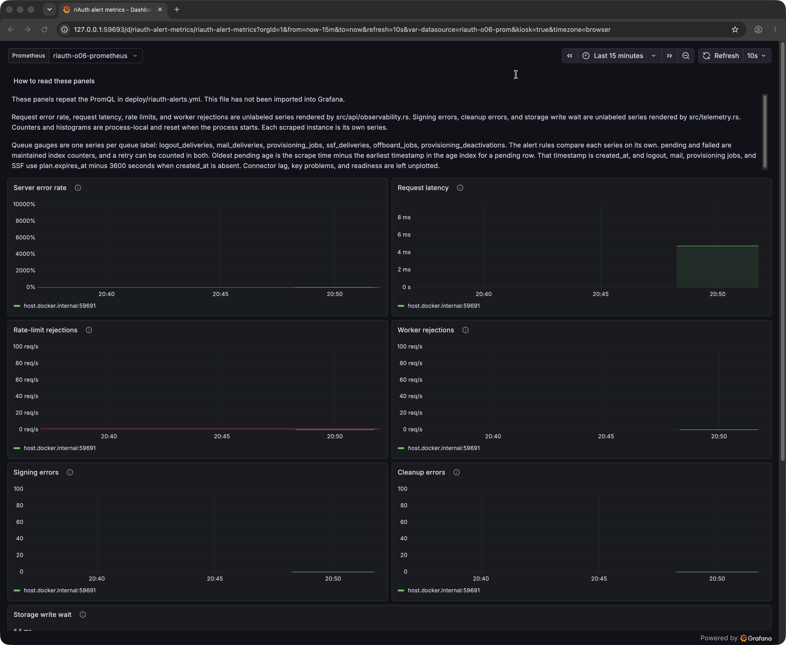
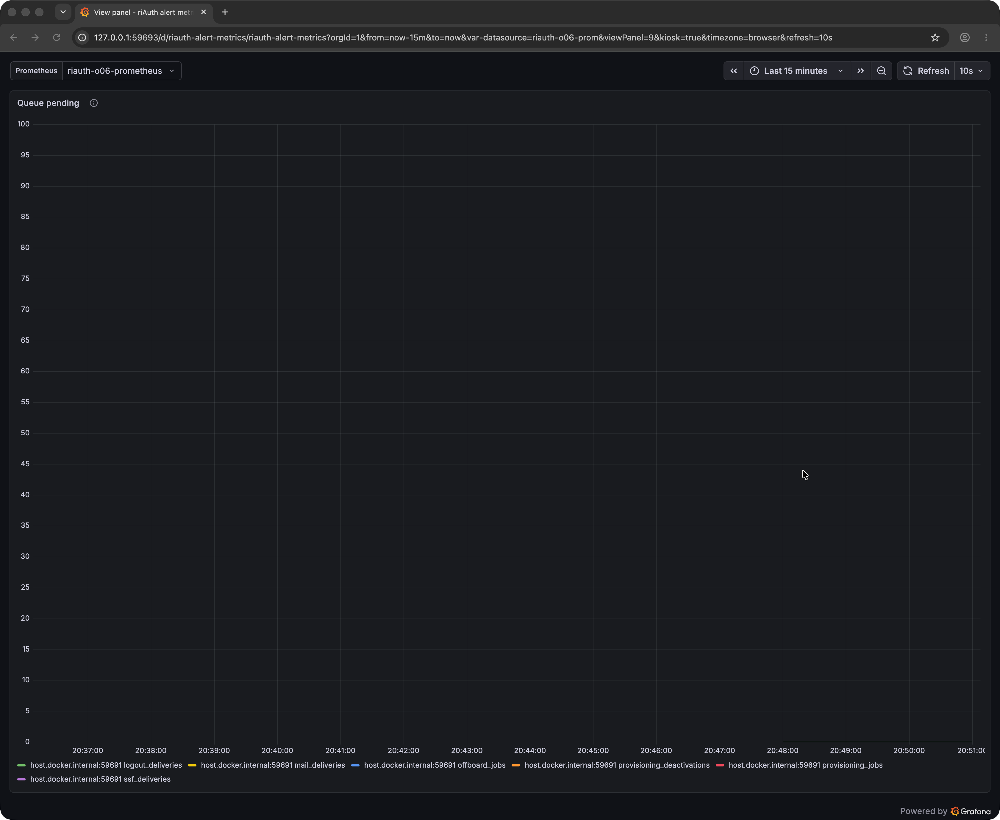
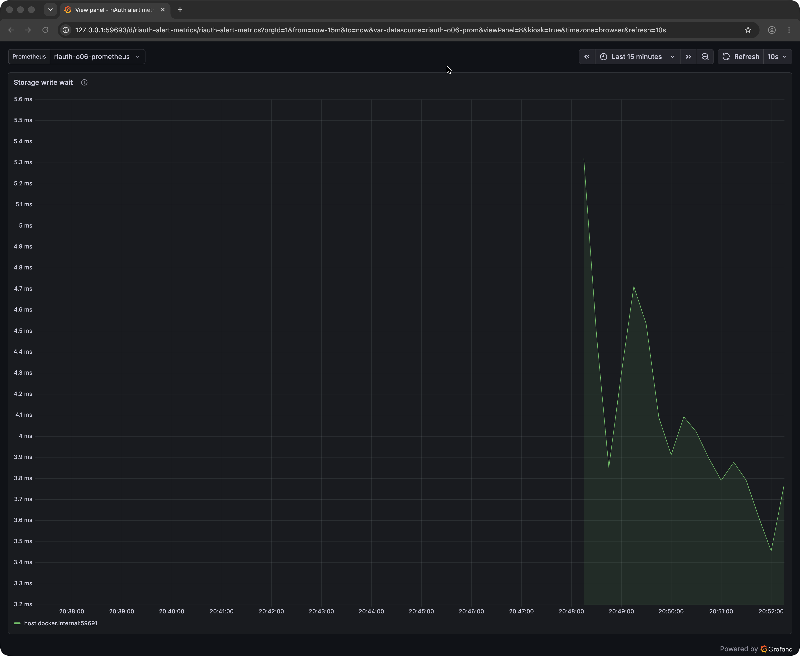
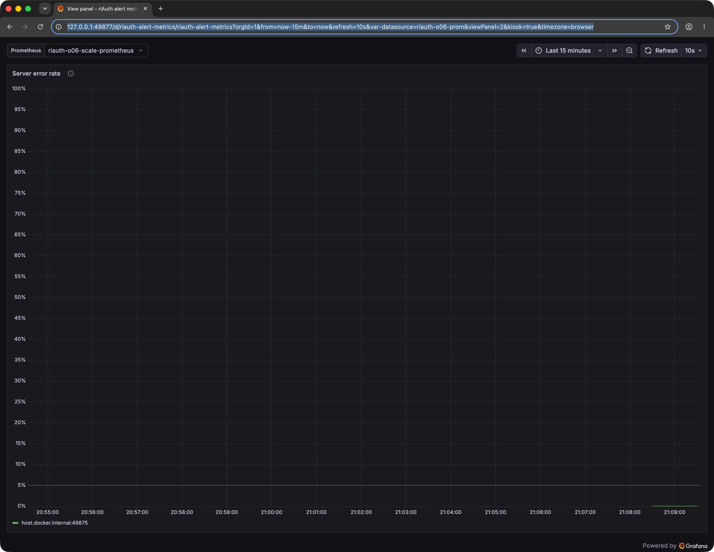

# O06 disposable Grafana loopback

Status: one local evidence slice. O06 stays open. Label remains **extend**. Journey remains `module`.

This page records two disposable loopback imports of [deploy/riauth-grafana.json](../../deploy/riauth-grafana.json) into Grafana OSS, with Prometheus scraping a disposable riAuth process. The first run is the parent commit. Its screenshots stay in this directory. The follow-up sets the server error rate field scale to min 0 and max 1 with unit `percentunit`, keeps the red threshold at 0.05, and replaces the panel text that said the file had not been imported. [deploy/prometheus.yml](../../deploy/prometheus.yml) and [deploy/riauth-alerts.yml](../../deploy/riauth-alerts.yml) stay unchanged. [scripts/check-grafana-dashboard.py](../../scripts/check-grafana-dashboard.py) stays a source check. It requires the dashboard text to cite `docs/roadmap/o06-grafana-loopback.md`, requires that error-rate scale, requires the red threshold to stay 0.05, and rejects the sentence "has not been imported".

## Provenance

The process was a private copy of the immutable Platform binary at `/Users/dominik/.cache/riauth-cargo/q09-maint-c7a61c6/riauth`. The cache file stayed mode `555`. The private copy was mode `500`. Both files are 290204712 bytes and SHA-256 `517093cbca1fdf56cfa093f43b79cd5d30405aa5bc10b68759ca4cbf63d92e6b`. No Cargo build was run for this slice.

That binary was built from source `c7a61c63dc124ddd2af6d91379381d6b9c928af4`. That commit is an ancestor of this worktree's pin `6ca4779b68cf41e29af490d2aca6ea3d59e1f2bd`. At that pin, before this documentation commit, `git diff` from `c7a61c6` is empty for `src/telemetry.rs`, `src/api/observability.rs`, `src/store/maintenance.rs`, `deploy/riauth-grafana.json`, `deploy/prometheus.yml`, `deploy/riauth-alerts.yml`, `scripts/check-grafana-dashboard.py`, and `docs/operations.md`.

Five commits sit between `c7a61c6` and the pin: `8c3aa7d`, `551ac63`, `a5769bb`, `7fb40d8`, and `6ca4779`. Together they change 11 files, 1054 insertions and 86 deletions: `docs/platform-guide.md`, `docs/roadmap/d01-platform-cli-walkthrough.md`, `docs/roadmap/q09-benchmark-slice.md`, `docs/testing.md`, `scripts/check-module-boundaries.py`, `scripts/q09_benchmark_slice.py`, `tests/test_q09_benchmark_slice.py`, `src/assembly.rs`, `src/assembly/source_saml_claim.rs`, `src/source/saml.rs`, and `tests/identity/saml_source.rs`. The binary does not contain those commits. Matching metric and dashboard files at the pin does not make the binary equivalent to the pin.

The corrected run used a new private copy of that same cache file. The copy was mode `500`, 290204712 bytes, and the same SHA-256. The cache file stayed mode `555`. No Cargo build was run. Grafana imported the worktree copy of `deploy/riauth-grafana.json`. That JSON is not inside the binary.

## Lab

Docker client and server were 29.7.2. The containers listened on loopback only.

| Service | Image | Image id | Listen |
| --- | --- | --- | --- |
| Prometheus | `prom/prometheus:v3.13.1` | `sha256:3c42b892cf723fa54d2f262c37a0e1f80aa8c8ddb1da7b9b0df9455a35a7f893` | `127.0.0.1:59692` |
| Grafana | `grafana/grafana-oss:12.4.3` | `sha256:2e986801428cd689c2358605289c90ab37d2b39e24808874971f54c99bcdc412` | `127.0.0.1:59693` |

The Prometheus image was already present locally, created `2026-07-10T08:49:11Z`. Its registry manifest was not confirmed separately. The Grafana image was the OSS build created `2026-04-14T08:24:54Z`, user `472`, and its local id matched the recorded pull digest. No Grafana Cloud or paid Grafana service was used. No existing container, image, or customer Grafana data was changed.

riAuth listened on `127.0.0.1:59691` with issuer `https://127.0.0.1:59691`. The server certificate named `IP:127.0.0.1`, `DNS:localhost`, and `DNS:host.docker.internal`. Prometheus reached that process through `host.docker.internal`. The lab scrape file kept the product scheme, path `/api/operations/prometheus`, 15 second interval, bearer file, and the product alert file. It changed the target from `identity.example.com:443` to `host.docker.internal:59691` and added `tls_config.ca_file` for the lab CA. That overlay was not copied into `deploy/prometheus.yml`.

The metrics credential was a generated agent token in a private file. The exposition text was checked against that file and the other lab secrets before this page was written. None of those secret values appeared in the exposition. Direct `riauth metrics --prometheus` reported `riauth_requests_total 29` and 97 metric names. Every metric name used by the dashboard was present.

## Import and scrape

The Prometheus datasource was created with HTTP 200. Its uid was `riauth-o06-prom`, its name was `riauth-o06-prometheus`, access was proxy, the URL was `http://riauth-o06-prometheus:9090`, it was the default datasource, the method was POST, and the interval was 15 seconds.

`POST /api/dashboards/db` sent message `o06 disposable loopback import` and returned HTTP 200, status `success`, uid `riauth-alert-metrics`, URL `/d/riauth-alert-metrics/riauth-alert-metrics`, version 1, slug `riauth-alert-metrics`, and an empty folder uid. A fetch of that version confirmed title `riAuth alert metrics`, schemaVersion 39, 11 panels, and the same 10 expressions as the product file.

Grafana's version history records version 1 at `2026-09-29T18:48:26Z` with message `Initial save`, then a lab-only version 2 at `2026-09-29T18:48:52Z` with message `lab datasource selection for the disposable render`. Version 2 selected datasource text `riauth-o06-prometheus` and value `riauth-o06-prom`, time `now-15m` to `now`, and refresh `10s`. That save stayed in the disposable Grafana data. The product JSON was not edited.

The scrape target was health `up`, scrape URL `https://host.docker.internal:59691/api/operations/prometheus`, last error empty, and last scrape `2026-09-29T18:48:13.781913003Z`. The alert group `riauth` from `/etc/prometheus/riauth-alerts.yml` returned HTTP 200. All 10 rules reported health `ok` and an empty last error: `RiAuthUnavailable`, `RiAuthHighErrorRate`, `RiAuthLatency`, `RiAuthRateLimits`, `RiAuthWorkerSaturation`, `RiAuthSignerFailures`, `RiAuthMaintenanceFailures`, `RiAuthStorageContention`, `RiAuthDeliveryBacklog`, and `RiAuthFailedDeliveries`. The saved summary has `state` null on every rule, so this page does not record a firing or inactive state.

Container ids for the run were `6bcac3f43ff98200b79c52e0a73a112d12ec0a186091155ed2445b8d71bee916` (Prometheus) and `c3ac996a555fb9314449a2c4600ccc0729bf2e78fed9bf6b1738fc9ce3c0b1c8` (Grafana).

## Queries

Prometheus `GET /api/v1/query` and Grafana `POST /api/ds/query` both returned HTTP 200 for every expression below. Prometheus status was `success`, result type `vector`, and the error fields were empty. Grafana reported no error. The continuing scrape had moved `riauth_requests_total` from the earlier direct value 29 to 31.

| PromQL | Series | Value |
| --- | --- | --- |
| `rate(riauth_server_errors_total[5m]) / clamp_min(rate(riauth_requests_total[5m]), 0.01)` | 1 | `0` |
| `histogram_quantile(0.95, rate(riauth_request_duration_seconds_bucket[5m]))` | 1 | `0.00475` |
| `rate(riauth_rate_limited_total[5m])` | 1 | `0` |
| `rate(riauth_worker_rejections_total[5m])` | 1 | `0` |
| `increase(riauth_signing_errors_total[5m])` | 1 | `0` |
| `increase(riauth_cleanup_errors_total[10m])` | 1 | `0` |
| `histogram_quantile(0.95, rate(riauth_storage_write_wait_seconds_bucket[5m]))` | 1 | `0.005319999999999998` |
| `riauth_queue_pending` | 6 | `0` on each series |
| `riauth_queue_failed` | 6 | `0` on each series |
| `riauth_queue_oldest_pending_seconds` | 6 | `0` on each series |
| `riauth_requests_total` | 1 | `31` |
| `up` | 1 | `1` |

The unlabeled series used instance `host.docker.internal:59691`. Each queue gauge used job `riauth` and these `queue` labels: `logout_deliveries`, `mail_deliveries`, `offboard_jobs`, `provisioning_deactivations`, `provisioning_jobs`, `ssf_deliveries`. Grafana returned 1 frame for each scalar expression and 6 frames for each queue expression, with the same labels and the same last values, except the write-wait frame stored `0.005319999999999991`. That differs from the Prometheus sample only in the last digits of the decimal text. Both answers are the same 95th-percentile write-wait sample, about 5.32 ms. No expression was rejected, and no panel expression needed a schema change.

## Render

An isolated Cua browser window rendered the loopback Grafana URL. The captures below are that window only, 3360 by 2756 PNG, and their URLs contain the loopback host, dashboard uid, and datasource uid. A scan of the PNG bytes found no private-key header, no `ri_agent_` token, and no password string.

`docs/roadmap/o06-grafana-loopback/dashboard-overview.png`, SHA-256 `e65fe59fddb39b638928140ef337d0ac6a781a92763d1bcf2dff9a1a331508e1`. The window title is `riAuth alert metrics - Dashboards - Grafana`. The page shows datasource `riauth-o06-prometheus`, the last 15 minutes, and refresh 10 seconds. The text panel says "This file has not been imported into Grafana." The server error rate series is flat at 0 for `host.docker.internal:59691`, and its y-axis runs from 0% through 10000%. That scale is the concrete defect in this capture: the panel used `percentunit` with no min or max, so an all-zero series was drawn against an autoscaled raw range of 100. The same window shows request latency, rate-limit rejections, worker rejections, signing errors, cleanup errors, and the storage write-wait title at the bottom edge.

`docs/roadmap/o06-grafana-loopback/queue-pending.png`, SHA-256 `08100d8aa4185f94175a2e837f08fa315e2e418066c987ae701c84cebcc086c4`. This is `viewPanel=9`. All six queue series sit at 0.

`docs/roadmap/o06-grafana-loopback/write-wait.png`, SHA-256 `618b17290bceb66772afb9a6fee5d570bd2fefe9f7098f9b68d02f7410ca476f`. This is `viewPanel=8`. The series is `host.docker.internal:59691`, and the drawn curve runs from about 3.4 ms to about 5.3 ms.

`viewPanel=10` and `viewPanel=11` were not captured. Their Prometheus and Grafana results are the six zero series in the table above.

## Recovered original API summaries

`/tmp/riauth-o06-grafana-lab` was removed after the parent commit. The files under [original-run](o06-grafana-loopback/original-run/provenance.json) are transcriptions of session tool stdout from that run. They are not byte copies of the deleted evidence files. `createdBy` was omitted. [query-dump-stdout.txt](o06-grafana-loopback/original-run/query-dump-stdout.txt) also contains an earlier Grafana shape probe whose frame count is 0. That probe is not the successful query. The successful frame counts and last values are [grafana-frames-stdout.txt](o06-grafana-loopback/original-run/grafana-frames-stdout.txt). Queue labels are [grafana-queue-frames.json](o06-grafana-loopback/original-run/grafana-queue-frames.json).

The session read of the Prometheus query file was truncated after `riauth_queue_pending`. [prometheus-queries.json](o06-grafana-loopback/original-run/prometheus-queries.json) keeps that object shape. The remaining series use the values printed for every series in the query dump, including job `riauth`. Scalar Grafana field labels were not printed, so [grafana-query-summary.json](o06-grafana-loopback/original-run/grafana-query-summary.json) records `field_labels_printed` false and the printed last values only. The import, datasource, target, rules, and version objects below were printed in full, aside from the omitted `createdBy` field:

- [target-health.json](o06-grafana-loopback/original-run/target-health.json)
- [rules.json](o06-grafana-loopback/original-run/rules.json)
- [datasource-create.json](o06-grafana-loopback/original-run/datasource-create.json)
- [dashboard-import.json](o06-grafana-loopback/original-run/dashboard-import.json)
- [dashboard-versions.json](o06-grafana-loopback/original-run/dashboard-versions.json)
- [import-query-stdout.txt](o06-grafana-loopback/original-run/import-query-stdout.txt)
- [versions-stdout.txt](o06-grafana-loopback/original-run/versions-stdout.txt)

## Corrected scale run

The follow-up lab listened on `127.0.0.1:49875` (riAuth), `127.0.0.1:49876` (Prometheus), and `127.0.0.1:49877` (Grafana). The containers were `riauth-o06-scale-prometheus` `49d7824bce3f6fa78e127be3320dd6e39f3a61f12aba164aa881eb82f1e0a24c` and `riauth-o06-scale-grafana` `081d1afb48740f17b96325953655094bc669aacd7870fc7bde30f33958b6c0f0`, on loopback only. The image ids were the same local `prom/prometheus:v3.13.1` and `grafana/grafana-oss:12.4.3` ids as the original run. Grafana health was HTTP 200, database `ok`, version `12.4.3`.

The scrape target was health `up`, scrape URL `https://host.docker.internal:49875/api/operations/prometheus`, last error empty, and last scrape `2026-09-29T19:08:26.411028085Z`. The same ten rules returned HTTP 200 with health `ok`, empty last error, and `state` null. The saved rules summary is byte-identical to the recovered original rules summary because those redacted fields match. This page still does not record a firing or inactive state.

Datasource create returned HTTP 200, uid `riauth-o06-prom`, name `riauth-o06-scale-prometheus`, access proxy, URL `http://riauth-o06-scale-prometheus:9090`. `POST /api/dashboards/db` sent message `o06 scale follow-up loopback import` and returned HTTP 200, status `success`, uid `riauth-alert-metrics`, version 1, slug `riauth-alert-metrics`, and an empty folder uid. A fetch of that version stored panel 2, "Server error rate", with min 0, max 1, unit `percentunit`, and red threshold 0.05. Grafana's version history then records version 1 at `2026-09-29T19:08:31Z` with message `Initial save`, and version 2 at the same timestamp with message `lab datasource selection for the corrected scale render`. The versions API did not store the request message. Version 2 selected datasource text `riauth-o06-scale-prometheus` and value `riauth-o06-prom`, time `now-15m` to `now`, and refresh `10s`. That save stayed in the disposable Grafana data.

Prometheus `GET /api/v1/query` returned HTTP 200, status `success`, result type `vector`, and empty error fields. Grafana `POST /api/ds/query` returned HTTP 200 with no error: 1 frame for each scalar and 6 frames for each queue gauge. The error-rate sample was `0`. Latency was `0.004749999999999999`. Write wait was `0.00711999999999999`. Rate-limit, worker, signing, and cleanup samples were `0`. Each queue gauge was `0` on `logout_deliveries`, `mail_deliveries`, `offboard_jobs`, `provisioning_deactivations`, `provisioning_jobs`, and `ssf_deliveries`. `riauth_requests_total` was `9` and `up` was `1`. The instance was `host.docker.internal:49875` and the job was `riauth`. The Grafana error-rate frame last values were timestamp `1790708911448` and value `0`.

An isolated Cua browser window rendered `viewPanel=2` for the anonymous viewer. The admin password was not typed. The capture is that window only, 3360 by 2600 PNG. Its URL contains the loopback host, dashboard uid, and datasource uid. A scan of the PNG bytes found no private-key header, no `ri_agent_` token, and no password string.

`docs/roadmap/o06-grafana-loopback/corrected-error-rate.png`, SHA-256 `7786baf48a01b820a47f38f0543fc48e591edbc77e6a420547fc7a84e32bb80a`. The window title is `View panel - riAuth alert metrics - Dashboards - Grafana`. The datasource is `riauth-o06-scale-prometheus`, the range is the last 15 minutes, and refresh is 10 seconds. The y-axis runs from 0% to 100% in 5% steps. The red threshold line sits at 5%. The series `host.docker.internal:49875` lies on 0%. A ratio above 1, which `clamp_min` on the denominator can produce, is clipped at the panel max of 1.

The corrected API summaries are the lab responses with credential fields left out. They live under [corrected-run](o06-grafana-loopback/corrected-run/provenance.json), including [error-rate-scale.json](o06-grafana-loopback/corrected-run/error-rate-scale.json), [prometheus-queries.json](o06-grafana-loopback/corrected-run/prometheus-queries.json), [grafana-queries.json](o06-grafana-loopback/corrected-run/grafana-queries.json), [target-health.json](o06-grafana-loopback/corrected-run/target-health.json), [dashboard-import.json](o06-grafana-loopback/corrected-run/dashboard-import.json), and [dashboard-versions.json](o06-grafana-loopback/corrected-run/dashboard-versions.json).

## Evidence hashes

[SHA256SUMS](o06-grafana-loopback/SHA256SUMS) lists every file in this directory except itself. Its SHA-256 is `6dc857c66e53f65cf0bbc604872b58511fc298739f8d9b1061b8fcdd56e60fb4`. The original overview, queue-pending, and write-wait hashes above are unchanged.

## What remains open

- Remote connector lag and delivery completion. `last_completed_at` is local controller completion time, recorded on [reconciliation diagnostics](o06-reconciliation-diagnostics.md).
- Physical allocation is [storage allocation](o06-storage-allocation.md). This dashboard does not plot it, and the recorded lab runs used a binary built before that series existed. An occupancy ratio still needs a validated configured capacity. A key-health status distinct from `meta/keys`, the doctor key id, and `riauth_signing_errors_total` is still open. The audit is [storage and key diagnostics](o06-storage-key-contract.md). Writer wait on this dashboard is not occupancy.
- Readiness, `/readyz`, and `/livez` are unchanged. This run adds no series.
- The Platform offboarding deactivation read can still show a missing account's target name to a full administrator. The shared aggregate is [provisioning deactivation diagnostics](o06-provisioning-deactivation-diagnostics.md).
- Diagnostic page reads still decode full stored values and do not size-cap a value.
- Node mismatch remains [O03](coverage-inventory.md).

Setup and the standing panel limits remain in [operations](../operations.md).
