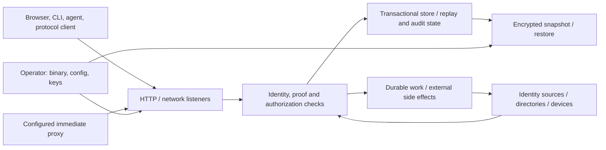

# Shared security threat model

This Q01 draft covers riAuth Essentials, riAuth Platform, and riauthctl. The
[invariant catalog](invariants.md) defines the security contracts and the later
Q02/Q05 test work. These documents describe the implementation at base revision
`96e23e2dedf84db4e39091a004cbd6591acbec97` (dependency update, Rust 1.98.1),
inspected on 2026-09-27. They do not establish that the roadmap is implemented or
that a released binary satisfies these contracts.

## Scope and evidence

The authorized product boundary is:

| Product | Required scope |
| --- | --- |
| riAuth Essentials | OIDC/OAuth, passkeys, complete browser self-service, compact administration, groups and claims, API/CLI, audit, backups, LDAP import, and outbound SCIM. |
| riAuth Platform | Essentials plus configurable workflows, broader protocols, advanced federation, cloud connectors, device integrations, and expanded administration. |
| riauthctl | Remote administration, with optional terminal USB-authenticator support separated from the server. |

Both server builds must retain identical identity, authorization, revocation,
and credential-protection semantics for shared capabilities. This is a required
policy, not evidence of two existing builds. [Cargo.toml](../../Cargo.toml) has
only `test-support` and `fuzzing` crate features; [the library](../../src/lib.rs)
exports the protocol and integration modules together, and
[CLI dispatch](../../src/cli.rs) currently combines server, maintenance, and
remote-client commands. The terminal authenticator dependency is currently in
the same package. [Release packaging](../../scripts/package-release.sh) names
one Linux x86-64 binary/image distribution; it does not prove Essentials,
Platform, riauthctl, or Linux ARM64 artifacts have been delivered.

Evidence labels apply throughout both documents:

| Label | Meaning |
| --- | --- |
| Observed enforcement | A named source path/symbol performs the stated check in the inspected baseline. This is scoped to that path, not an exhaustive audit. |
| Existing regression | A named test's source exercises part of the contract. Tests were inspected, not executed for Q01. Fixtures and ignored integration tests are not release or real-peer evidence. |
| Intended policy | A required shared contract or a future capability's acceptance condition, with no claim of complete implementation. |
| Observed gap | A concrete missing capability or limit visible in source/documentation. |
| Suspected gap | A specific source-supported question needing a regression, implementation review, or product decision. It is not a demonstrated exploit. |
| Demonstrated finding | A reproduced violation with inputs, output/state, and exact revision evidence. Q01 produced no such findings and ran no security harness. |

A01's `docs/roadmap/coverage-inventory.md` and `.json`, and A02's
`docs/roadmap/product-contracts.md` and `capability-matrix.json`, became available
after the initial dependency read and were reviewed read-only. The
[handoff](invariants.md#dependency-reconciliation-and-validation) records exact
snapshot digests, crosswalks and remaining decisions. Their drafts agree on the
shared semantic requirement and the principal implementation gaps. A02 proposes
default restored-session/proof/grant invalidation and persistent-credential
reconciliation, which Q01 now includes as intended policy. Neither draft is an
orchestrator-reviewed final contract; final acceptance still requires that review.

## Assets, actors, and assumptions

Protect stable user IDs and issuer/subject mappings; administrator authority;
password hashes, TOTP seeds, recovery proofs, private keys and connector
credentials; sessions, consent, grants and replay records; reviewed plan content;
device/certificate bindings; configuration revisions; durable jobs and leases;
and audit evidence. Configuration, secret paths, database encryption keys, and
external signing services are security dependencies, not incidental deployment
details.

| Actor | Attacker-controlled inputs and capabilities |
| --- | --- |
| Unauthenticated network caller | URL/query/form/JSON fields, duplicate headers and parameters, cookies, bearer-looking strings, proof JWT/XML, callback state, username/password guesses, request timing, retries and disconnects. |
| Authenticated ordinary user | Their own session/proofs; account, factor, recovery, consent, and temporary-access requests; another account's identifiers supplied as targets; concurrent tabs and stale pages. Authentication does not grant administration. |
| Scoped agent or stolen agent credential | Allowed action/resource pairs plus arbitrary management targets, manifests, plan objects, supplied secret values, revision/idempotency/run IDs, and delayed-job creation. Ownership by a user adds no permissions. |
| OAuth/SAML client or compromised relying party | Registered protocol inputs, redirect/resource/scope choices, signed requests, client assertions, device grants, exchange requests, and retry/replay attempts. It cannot choose another client's grants or create its own inbound signing trust merely by knowing its secret. |
| Compromised upstream/connector peer | Responses, identity attributes, pagination links, partial or empty snapshots, HTTP errors/ETags, delayed acknowledgements, signed signals within its configured trust, and network stalls. A trusted source still has only its explicit local links and configured assurance authority. |
| Untrusted application/browser origin | CSRF requests, script-visible storage, injected proxy identity/forwarding headers, cookie tossing, WebSocket origin, and return URL choices. A trusted immediate proxy has additional delegated authority that the operator must constrain. |
| Storage/backup holder without decryption keys | Copies, truncation, substitution, and reordering of ciphertext; old legitimate encrypted archives. Encryption authenticates content; it does not prove snapshot freshness. Plain storage exposes substantially more if the holder can read it. |
| Authorized operator | Binary/configuration selection, trust anchors, secret files, restore/import, and recovery. A mistaken downgrade or old restore is in scope as an operational security transition. An operator controlling the running process and all keys can replace enforcement; protection against that full compromise is not claimed. |

The operating system, executable and libraries, wall clock, configured trust
anchors, signing services, and the database's transaction/fencing guarantees are
dependencies. A malicious process owner, database administrator with decrypted
write access, or compromised pinned signer exceeds the corresponding trust
boundary. [Database TLS policy](../../src/postgres_store.rs) and encrypted
records reduce particular exposures; they do not supply deployment election,
replication, or fencing. [Availability](../availability.md) defines those limits.
No immediate termination of an independently maintained application session,
offline JWT, established WebSocket, or disconnected device is assumed.

## Trust boundaries

The following boundary IDs are stable and independent of file layout. Each
enforcement reference points to source; symbols and detailed test contracts are
in the linked invariant IDs.

| Boundary | Data crossing it; failure to prevent | Observed enforcement and test evidence | Invariant coverage |
| --- | --- | --- | --- |
| TB-01: network/browser to session | Credentials, SSO/binding cookies, Origin/Fetch Metadata, interaction ID and `session_ref`. Prevent credential enumeration, CSRF, session confusion, another tab's proof, and a browser credential becoming an administrative bearer. | [Browser write guard](../../src/portal/http.rs), [staging/attach](../../src/signin.rs), [interaction handlers](../../src/api/interaction.rs), [browser decisions](../../src/browser.rs); [signin core](../../tests/signin_core.rs), [browser sign-in](../../tests/browser_signin.rs). | RI-CRED-001/002; RI-SES-001/002/003 |
| TB-02: protocol client to grants/claims | Redirect, PKCE, client authentication, scopes, resource, nonce, PAR/JAR, DPoP, assertions, exchange actor/parent. Prevent grant substitution, replay, scope expansion, and weaker proof fallback. | [OIDC](../../src/oidc.rs), [authorization references](../../src/authorization.rs), [DPoP](../../src/dpop.rs), [JOSE](../../src/jose.rs), [exchange](../../src/exchange.rs), [provider validation](../../src/provider.rs); [OIDC regressions](../../tests/identity/oidc.rs). | RI-ACC-001; RI-SES-002/003/005; RI-AUTH-001/002 |
| TB-03: identity/recovery to account authority | Account ID, purpose/email/epoch-bound mail proof, new credentials, factor enrollment/removal, administrator recovery. Prevent account replacement, recovery stripping factors, last-admin loss, and revival after re-enable. | [Core](../../src/core.rs), [lifecycle](../../src/lifecycle.rs), [passkeys](../../src/passkey.rs), [central user transitions](../../src/store.rs), [password history](../../src/identity/password_history.rs); [factor tests](../../tests/identity/factors.rs), [SSF tests](../../tests/ssf.rs), [password-history tests](../../tests/password_history.rs). | RI-ACC-001/002; RI-CRED-001/002/003; RI-SES-004 |
| TB-04: management caller to mutations | Agent token, action/resource, parent identity, manifest/plan/hash/issuer, secret references/versions/values, revision, retry key and audit attribution; future author/reviewer/executor roles and approvals. Prevent delegation, target privilege escalation, approval changes, stale writes, duplicate secret rotation and partial commits. | [Agent authority](../../src/agent.rs), [state reconciliation](../../src/state.rs), [mutation receipts](../../src/context.rs), [HTTP fingerprints](../../src/api.rs), [audit](../../src/core.rs); [management tests](../../tests/identity/operations.rs), [parent tests](../../tests/agent_parent.rs). Multi-party review is intended policy. | RI-MGT-001/002/003/004/005 |
| TB-05: directories/SCIM/offboarding/signals to local and remote state | Stable external ID, complete snapshot, pagination, target fingerprint, reviewed removals, remote ETag, job creator, due instant/cancel/lease, signed SET issuer/subject/event. Prevent incomplete import causing bulk disable, wrong-account disable, stale authority, retries duplicating remote work, or a local success being reported as downstream completion. | [LDAP import](../../src/directory.rs), [cloud import](../../src/cloud_directory.rs), [inbound SCIM](../../src/scim.rs), [outbound jobs](../../src/provisioning.rs), [offboarding](../../src/offboarding.rs), [SSF](../../src/ssf.rs); [LDAP](../../tests/ldap.rs), [cloud](../../tests/cloud_directory.rs), [SCIM OAuth](../../tests/scim_oauth.rs), [offboarding](../../tests/offboarding.rs), [SSF](../../tests/ssf.rs). | RI-CON-001/002/003/004; RI-SES-004; RI-MGT-002/004 |
| TB-06: suspended/future workflow to authentication | Source ID/link, upstream JWT or SAML response/state, authorization/stage IDs, nonce, request hash, pinned local user, expiry and claimed assurance. Prevent skipping a required stage, mixing instances/accounts, trusting email as a link, or inventing MFA/authentication time. General workflow definitions and dependency versions are future inputs. | [Source stages](../../src/source.rs), [SAML source](../../src/source/saml.rs), [SAML interaction](../../src/saml.rs); [stage tests](../../tests/source_stage.rs), [source tests](../../tests/identity/sources.rs), [SAML source tests](../../tests/identity/saml_source.rs). No general workflow engine is identified in [module exports](../../src/lib.rs). | RI-WF-001/002; RI-SES-002; RI-AUTH-001 |
| TB-07: proxy to application | Immediate peer address, forwarded host/scheme/path/method, return URL, Origin, proxy cookie, identity headers and application cookie. Prevent header impersonation, open redirect, cross-origin writes, disclosure of riAuth cookies, and stale parent authorization. | [Outpost](../../src/outpost.rs), [embedded proxy](../../src/proxy_server.rs), [trusted-peer attribution](../../src/api/rates.rs); [proxy tests](../../tests/outpost.rs), [Traefik tests](../../tests/outpost_traefik.rs), [network tests](../../tests/identity/network.rs). | RI-PROXY-001/002 |
| TB-08: device/certificate verifier to identity/assurance | Signed trust JWT, pinned key/algorithm/audience, challenge nonce, device ID/session/epoch; enrolled device secret, online ticket or offline MAC; certificate chain, explicit binding, trusted proxy certificate header. Prevent forged device trust, cross-session transfer, bearer substitution, and authentication from an unbound or revoked certificate. | [Device trust](../../src/device_trust.rs), [Windows protocol](../../src/windows_login.rs), [mTLS](../../src/mtls.rs), [EAP-TLS](../../src/radius/eap.rs); [device](../../tests/device_trust.rs), [Windows](../../tests/windows_login.rs), [mTLS](../../tests/mtls.rs), [EAP](../../tests/identity/radius_eap.rs). | RI-DEV-001/002/003 |
| TB-09: core/preparation to storage | Point/range reads, authority and deadlines, staged writes, indexes, audit and queue updates, backend encoding/key. Prevent stale verification committing, lost updates, partial replay consumption, orphaned indexes and plaintext fallback. | [Store](../../src/store.rs), [prepared writes](../../src/store/prepared.rs), [derived indexes](../../src/store/maintenance.rs), [PostgreSQL](../../src/postgres_store.rs); [storage regressions](../../tests/storage.rs), [PostgreSQL integration](../../tests/postgres.rs). | RI-STORE-001/002; RI-MGT-004 |
| TB-10: live deployment to archive/restore | Consistent plaintext snapshot before sealing, encrypted chunks/final manifest, issuer/schema, output directory, external file/signer dependencies, snapshot age. Prevent corruption, cross-record substitution, overwrite and loss of identity; assess restoration of old revoked or consumed state. | [Backup/restore](../../src/operations.rs), [AEAD](../../src/crypto.rs), [schema migration](../../src/upgrade.rs); [operations](../../tests/operations.rs), [backup/upgrade tests](../../tests/identity/operations.rs). | RI-STORE-002/003/004; RI-DIST-003 |
| TB-11: distribution/operator config to reachable capability | Compiled modules, enabled listeners/routes/workers, configured trust/peers, stored requirements, artifact/config/schema version, headless/client USB support. Prevent silently ignored security settings, reduced factor/revocation policy, or inconsistent identities after product switch. | Current [configuration](../../src/config.rs), [router](../../src/api.rs), [server workers](../../src/api/server.rs), [package](../../Cargo.toml), [CLI transport](../../src/cli/transport.rs), [upgrade](../../src/upgrade.rs); [CLI](../../tests/cli.rs), [upgrade](../../tests/identity/operations.rs). Distribution checks are intended policy pending A02/build separation. | RI-DIST-001/002/003; RI-WF-002 |

## Security-relevant existing limits

These limits must remain visible when building new interfaces or distributions:

- **Lifetime and revocation differ.** `Core::session` checks CLI expiry;
  `identity_user` checks the user epoch, source/certificate authority, and session
  revocation without imposing CLI expiry on an explicitly approved offline
  grant. [OIDC tests](../../tests/identity/oidc.rs), including
  `cli_expiry_does_not_end_an_explicit_offline_grant`, document this distinction.
  Online riAuth checks see updated policy. An already signed token evaluated
  offline keeps its claims until expiry; a relying party owns its application
  session. See [OIDC profiles](../oidc-profiles.md) and RI-SES-005.
- **Freshness is path-specific.** Local terminal browser/SAML approvals require
  authentication within 300 seconds; `saml::stale` excludes identities whose
  `auth_time` is zero. OAuth-only sources deliberately do not invent that time
  or OIDC/MFA assurance. Tests explicitly cover the terminal exception. Factor
  mutation and request `max_age`/`prompt=login` have their own checks. Do not turn
  the exception into a general freshness bypass (RI-CRED-002, RI-WF-001).
- **Raw secrets sometimes must be retained.** Mail delivery bodies contain a
  one-use mail token; retry receipts can contain a returned client/agent/device
  credential. Local signing keys and TOTP seeds also need recoverable custody.
  [Encryption at rest](../../src/store.rs) is optional by default in
  [Config](../../src/config.rs). Secret hashes/redacted API views do not mean the
  whole database contains no usable secrets (RI-STORE-002).
- **Local and remote effects have separate commits.** A disable commits local
  revocation with durable per-target SCIM deactivation intent. Delivery happens
  later under a scoped controller, and a target is reported delivered only after
  it confirms the account inactive. Outbound provisioning performs network writes outside a local
  transaction, then reconciles results under a lease. It can report partial/stale
  progress; it cannot promise remote rollback or universal exactly-once delivery.
  Logout and SSF delivery also depend on peers (RI-CON-002/003/004).
- **Device offline bounds are explicit.** The server's
  [Windows protocol](../../src/windows_login.rs) `windows_offline_verify` consults
  live device/user state. A truly disconnected
  credential provider cannot learn new revocation until it reconnects; the
  documented maximum offline ticket lifetime is 72 hours. A packaged Windows
  credential provider is not shipped. See [Windows protocol](../enterprise/ENT-13.md).
- **Restore authenticates a snapshot, not its recency.** Restore imports the
  snapshot's sessions, epochs, grants, proofs, receipts, audit and job state.
  Existing tests intentionally preserve access tokens. No external monotonic
  revocation ledger is checked by [restore](../../src/operations.rs)
  `commit_restore`. Restoring old state can
  restore authority or unconsumed state that changed later, subject to its
  remaining expiry. Stop/fence writers and reconcile recovery before serving;
  do not claim anti-rollback protection. A02's proposed safer default requires
  invalidating restored sessions/proofs/grants and reconciling or rotating restored
  persistent credentials before use; the baseline does not implement it
  (RI-STORE-004).
- **Shared-node configuration is a dependency.** PostgreSQL shares transactional
  state but not every node's configuration files, verifier files, process token
  cache or all rate limits. `forward_auth` limits are per process. Product parity
  and safe config rollout need checks beyond opening a shared database.

## Prioritized gaps and disposition

| Gap | Evidence classification and consequence | Required follow-up |
| --- | --- | --- |
| G-01: distribution and workflow enforcement | Observed gap: one package, no Essentials/Platform capability gates or general configurable-workflow engine identified. Two-build security parity cannot be established from current tests. | Reconcile A01/A02; implement RI-DIST-001/002/003 and RI-WF-002 contracts once the targets exist. Shared unsupported requirements must cause explicit rejection. |
| G-02: contract coverage across all writers/interfaces/backends | Coverage gap: many focused regressions exist, but no reusable all-entrypoint matrix was identified. Store helper tests alone do not prove every caller reads every authority/deadline dependency. | Q02 first builds shared adapters and negative-input contracts; Q05 pauses actual credential/signing operations and races revocation/expiry against commit (RI-STORE-001). |
| G-03: restore rollback and unfinished side effects | Observed mechanism: import preserves old security/job state. A later-disable/consumption/rotation rollback scenario is not established by existing preservation tests. No exploit was reproduced. | Q05 characterizes old-snapshot effects; Q02 must enforce A02's proposed default session/proof/grant invalidation and persistent-credential reconciliation/rotation, subject to review. Identity continuity, fencing and remote job reconciliation remain necessary. |
| G-04: approval and retry dependencies | Observed limit: state plans bind secret references/versions, not secret bytes resolved at apply. `apply_state` returns an applied result before rerunning `reconcile`; `mutation` rechecks actor/permission snapshot before returning a receipt, not the endpoint body. | Q02 tests reduced permissions, changed target authority, secret/reference/version substitutions and cached-result disclosure. Decide whether byte commitments and further result-read authorization are required; treat this as a suspected gap until reproduced/reviewed (RI-MGT-002/003). |
| G-05: in-flight connector authorization | Observed limit: job claim checks authority/revision/config, and finish checks authority/revision/lease after the remote operation. Revocation during the remote call cannot undo an accepted remote write. | Q05 pauses an actual remote request, revokes actor/parent or expires lease, and asserts honest partial/stale state plus no next unauthorized dispatch. Do not assert a distributed transaction (RI-CON-002). |
| G-06: browser and artifact completeness | Observed gap: account lifecycle mail bodies direct users to CLI completion; module/route presence does not establish complete browser factor/recovery/admin journeys. Release script is source evidence only. | Keep full Essentials scope; later browser paths must reuse these contracts. A01/A02 and later artifact/real-browser acceptance must establish end-to-end coverage. No certification, interoperability, performance or recovery-time claim follows from Q01. |

These gaps are implementation or evidence work, not reasons to relax shared
semantics. No production changes, tests, deployment, external contact, task
completion, or new harness execution were performed as part of Q01.
